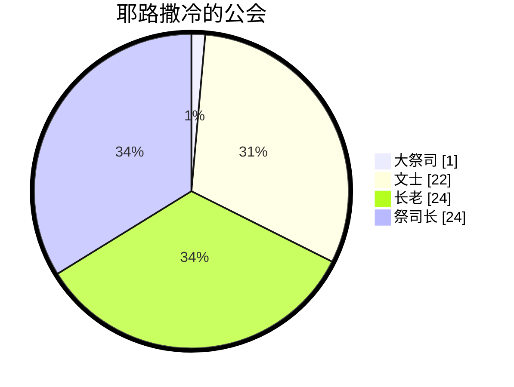
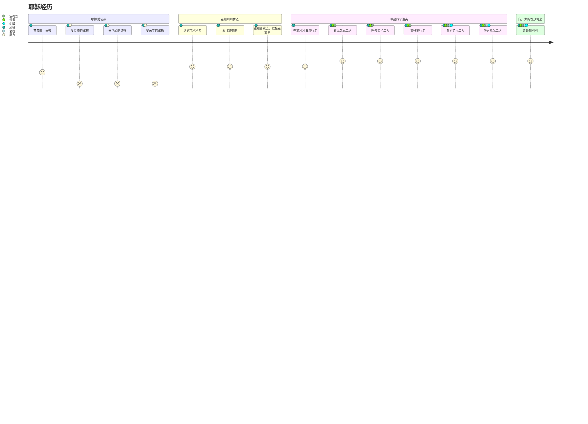
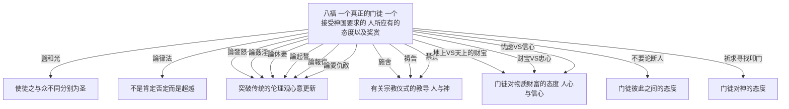
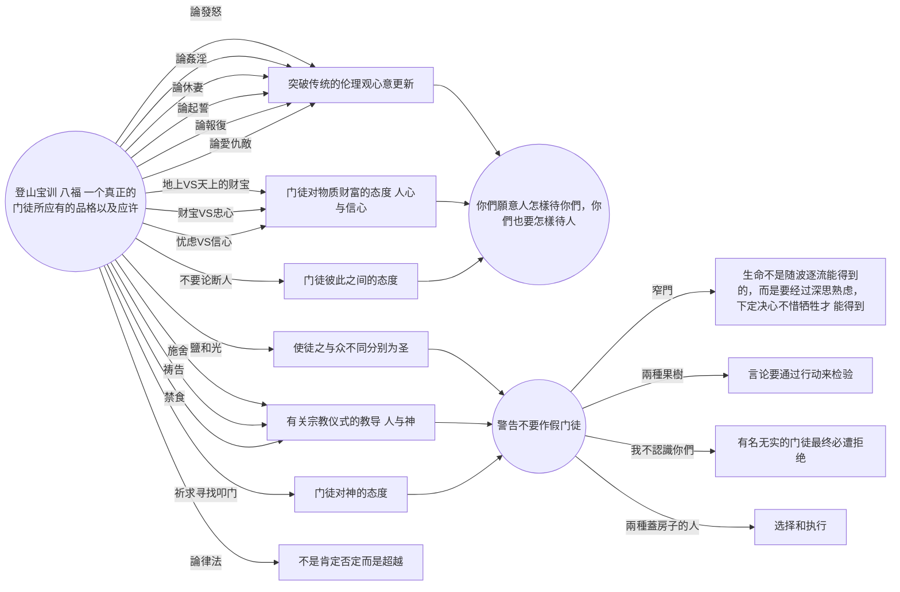
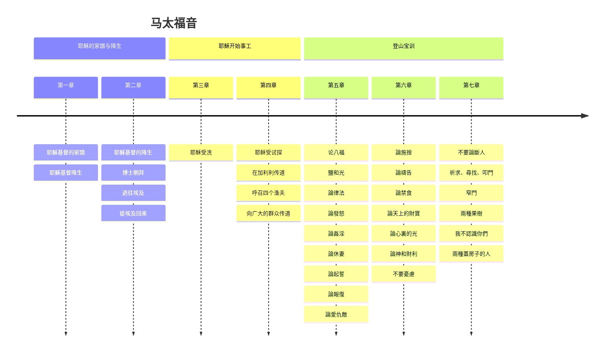
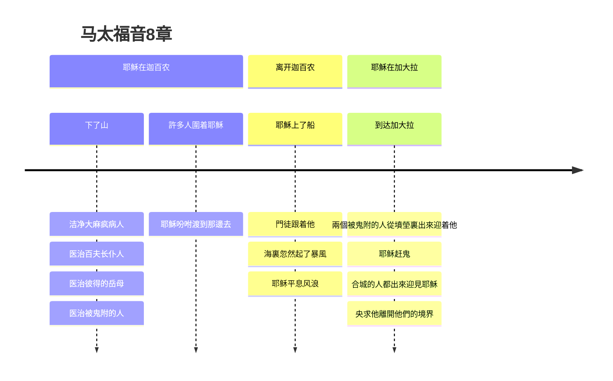
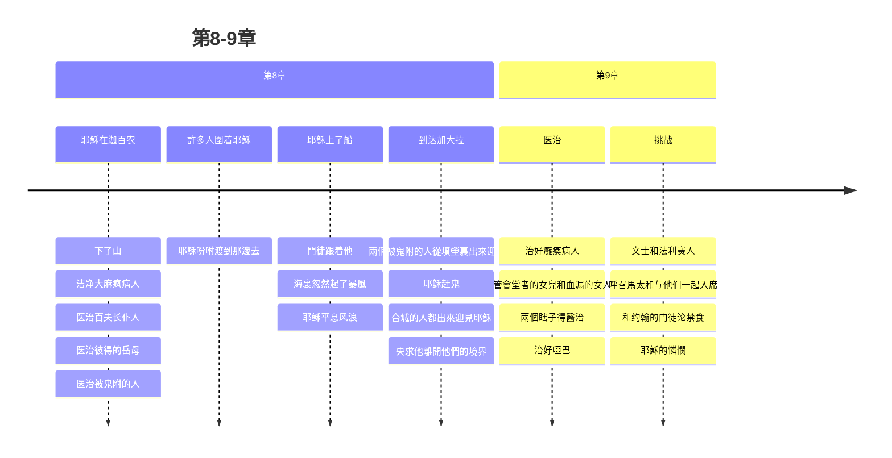

[马太福音](https://www.bible.com/bible/111/MAT.4.NIV)
[第一章](#第一章)
[第二章](#第二章)
[第三章](#第三章)
[第四章](#第四章)
[第五章](#第五章)
[第六章](#第六章)
[第七章](#第七章)
[第八章](#第八章)
[第九章](#第九章)
[第十章](#第十章)
[第十一章](#第十一章)
[第十二章](#第十二章)
[第十三章](#第十三章)
[第十四章](#第十四章)
[第十五章](#第十五章)
[第十六章](#第十六章)
[第十七章](#第十七章)
[第十八章](#第十八章)
[第十九章](#第十九章)
[第二十章](#第二十章)

## 第一章
### 经文
1 亚伯拉罕的后裔，大卫的子孙，耶稣基督的家谱：
2 亚伯拉罕生以撒；以撒生雅各；雅各生犹大和他的弟兄； 3犹大从她玛氏生法勒斯和谢拉；法勒斯生希斯仑；希斯仑生亚兰； 4亚兰生亚米拿达；亚米拿达生拿顺；拿顺生撒门； 5撒门从喇合氏生波阿斯；波阿斯从路得氏生俄备得；俄备得生耶西； 6耶西生大卫王。大卫从乌利亚的妻子生所罗门； 7所罗门生罗波安；罗波安生亚比雅；亚比雅生亚撒； 8亚撒生约沙法；约沙法生约兰； 约兰生乌西雅； 9乌西雅生约坦；约坦生亚哈斯；亚哈斯生希西家； 10希西家生玛拿西；玛拿西生亚们；亚们生约西亚； 11百姓被迁到巴比伦的时候，约西亚生耶哥尼雅和他的弟兄。12迁到巴比伦之后，耶哥尼雅生撒拉铁；撒拉铁生所罗巴伯； 13所罗巴伯生亚比玉；亚比玉生以利亚敬；以利亚敬生亚所； 14亚所生撒督；撒督生亚金；亚金生以律； 15以律生以利亚撒；以利亚撒生马但；马但生雅各； 16雅各生约瑟，就是马利亚的丈夫。那称为基督的耶稣是从马利亚生的。
17这样，从亚伯拉罕到大卫共有十四代；从大卫到迁至巴比伦的时候也有十四代；从迁至巴比伦的时候到基督又有十四代。18耶稣基督降生的事记在下面：他母亲马利亚已经许配给约瑟，还没有迎娶，马利亚就从圣灵怀了孕。 19她丈夫约瑟是个义人，不愿意当众羞辱她，想要暗地里把她休了。 20正考虑这些事的时候，忽然主的使者在约瑟梦中向他显现，说：“大卫的子孙约瑟，不要怕，把你的妻子马利亚娶过来，因她所怀的孕是从圣灵来的。 21她将要生一个儿子，你要给他起名叫耶稣，因他要将自己的百姓从罪恶里救出来。” 22这整件事的发生，是要应验主藉先知所说的话：
23“必有童女怀孕生子；人要称他的名为以马内利。”（以马内利翻出来就是“上帝与我们同在”。）
24 约瑟醒来，就遵照主的使者的吩咐把妻子娶过来； 25但是没有和她同房，直到她生了儿子，就给他起名叫耶稣。
### 观察
1. 马太福音以什么形式开始
2. 家谱中有几个母亲？
3. 家谱中有几代？
4. 摩西/约书亚在哪里？他们在家谱中吗？
### 解释
1. 为什么说是亚伯拉罕的后裔，大卫的子孙？
2. 为什么是这四位母亲？她们有什么特征？
3. 为什么分三个14代？每个14代都有什么特征？
4. 为什么以家谱开始？


### 归纳
 - 亚伯拉罕-大卫：家族
 - 大卫到迁移： 国
 - 迁移到新约：重建/救赎

神的计划和拣选是神的主权
1. 启示战胜律法、自我 
2. 旧约的应许实现在新约
3. 神借人做工
### 应用
	神借人做工，我们如何回应？
## 第二章
### 经文
#### 博学之士朝拜
1在希律作王的时候，耶稣生在犹太的伯利恒。有几个博学之士从东方来到耶路撒冷，说： 2“那生下来作犹太人之王的在哪里？我们在东方看见他的星，特来拜他。” 3希律王听见了，就心里不安；耶路撒冷全城的人也都不安。 4他就召集了祭司长和民间的文士，问他们：“基督该生在哪里？” 5他们说：“在犹太的伯利恒。因为有先知记着：
6‘犹大地的伯利恒啊，
你在犹大诸城中并不是最小的；
因为将来有一位统治者要从你那里出来，
牧养我以色列民。’”
7于是，希律暗地里召了博学之士来，查问那星是什么时候出现的， 8就派他们往伯利恒去，说：“你们去仔细寻访那小孩子，找到了就来报信，我也好去拜他。” 9他们听了王的话就去了。忽然，在东方所看到的那颗星在前面引领他们，一直行到小孩子所在地方的上方就停住了。 10他们看见那星，就非常欢喜； 11进了房子，看见小孩子和他母亲马利亚，就俯伏拜那小孩子，揭开宝盒，拿出黄金、乳香、没药，作为礼物献给他。 12因为在梦中得到主的指示，不要回去见希律，他们就从别的路回自己的家乡去了。
#### 逃往埃及
13他们走后，忽然主的使者在约瑟梦中向他显现，说：“起来！带着小孩子和他母亲逃往埃及，住在那里，等我的指示；因为希律要搜寻那小孩子来杀害他。” 14约瑟就起来，连夜带着小孩子和他母亲往埃及去， 15住在那里，直到希律死了。这是要应验主藉先知所说的话：“我从埃及召我的儿子出来。”
### 屠杀男孩
16 希律见自己被博学之士愚弄，极其愤怒，差人将伯利恒城里和四境所有的男孩，根据他向博学之士仔细查问到的时间，凡两岁以内的，都杀尽了。 17这就应验了耶利米先知所说的话：
18“在拉玛听见号啕大哭的声音，
是拉结哭她儿女；
她不肯受安慰，
因为他们都不在了。”
#### 从埃及回来
19 希律死了以后，在埃及，忽然主的使者在约瑟梦中向他显现， 20说：“起来，带着小孩子和他母亲回以色列地去！因为要杀害这小孩子的人已经死了。” 21约瑟就起来，带着小孩子和他母亲进入以色列地去。 22但是他因听见亚基老继承他父亲希律作了犹太王，怕到那里去；又在梦中得到主的指示，就往加利利境内去了。 23他们到了一座城，名叫拿撒勒，就住在那里。这是要应验先知所说的话：“他将称为拿撒勒人。”
### 观察
1. 希律王听见了，就心里不安，为什么？
2. 为什么耶路撒冷全城的人也都不安？
3. 博士来的作用？好的影响？不好的影响？
4. 博士献的什么礼物？
	[黄金](https://www.bible.com/search/bible?query=%E9%BB%84%E9%87%91)
	[乳香](https://www.bible.com/search/bible?query=%E4%B9%B3%E9%A6%99)
	[没药](https://www.bible.com/search/bible?query=%E6%B2%A1%E8%8D%AF)

|   |   |   |   |
|---|---|---|---|
|**人物**|**引导/启示方式**|**反应**|**预言的应验**|
|博士|星/梦|带礼物敬拜/离开|犹大地的伯利恒啊|
|约瑟|梦|离开/回来|我从埃及召我的儿子出来/他将称为拿撒勒人|
|希律王|无/问别人|不安/杀戮|耶利米先知所说的话|
|祭司长和文士|先知的话|应该包括在全城人（不安）|犹大地的伯利恒啊|
|耶路撒冷全城的人|听博士说|不安||

### 解释

### 应用
神的主权：
- 耶稣为王
- 神要成就的事一定会成就，可以用不同人不同方式呈现出来。
- 我们需要做的。。。？
## 第三章
### 经文

##### 施洗约翰传道
可1‧1－8；路3‧1－18；约1‧19－28）
1那时，有施洗的约翰出来，在犹太的旷野传道，说： 2「天国近了，你们应当悔改」 3这人就是先知以赛亚所说的。他说：「在旷野有人声喊着说：预备主的道，修直他的路」
4这约翰身穿骆驼毛的衣服，腰束皮带，吃的是蝗虫、野蜜。 5那时，耶路撒冷和犹太全地，并约旦河一带地方的人，都出去到约翰那里， 6承认他们的罪，在约旦河里受他的洗。 7约翰看见许多法利赛人和撒都该人也来受洗，就对他们说：「毒蛇的种类！谁指示你们逃避将来的忿怒呢？ 8你们要结出果子来，与悔改的心相称。 9不要自己心里说：『有亚伯拉罕为我们的祖宗。』我告诉你们，　神能从这些石头中给亚伯拉罕兴起子孙来。 10现在斧子已经放在树根上，凡不结好果子的树就砍下来，丢在火里。 11我是用水给你们施洗，叫你们悔改。但那在我以后来的，能力比我更大，我就是给他提鞋也不配。他要用圣灵与火给你们施洗。 12他手里拿着簸箕，要扬净他的场，把麦子收在仓里，把糠用不灭的火烧尽了。」
##### 耶稣受洗
（可1‧9－11；路3‧21－22）
13当下，耶稣从加利利来到约旦河，见了约翰，要受他的洗。 14约翰想要拦住他，说：「我当受你的洗，你反倒上我这里来吗？」 15耶稣回答说：「你暂且许我，因为我们理当这样尽诸般的义。」于是约翰许了他。 16耶稣受了洗，随即从水里上来。天忽然为他开了，他就看见　神的灵仿佛鸽子降下，落在他身上。 17从天上有声音说：「这是我的爱子，我所喜悦的。」

### 观察
- 时间，地点，人物，事件，原因和经过
- 约翰穿什么？吃什么？
- 约翰的使命是什么？
- 约翰的身上，可以看到有哪些特质？
- 约翰的影响有哪些？
- 约翰是如何看待耶稣的？
- 法利赛人和撒都该人是什么人？约翰为什么称他们毒蛇的种类
- 洗礼在耶稣身上体现的是什么？
- 约翰和耶稣的关系怎么描述的？
- 如果没有耶稣，约翰还有存在的价值吗？如果没有约翰，耶稣还有存在的价值吗？
### 解释
1. 旷野在哪里？[犹太的旷野](https://zh.wikipedia.org/zh-hans/%E7%8A%B9%E5%A4%A7%E6%97%B7%E9%87%8E#cite_note-1)
2. 约翰为什么给人施洗？人们为什么要到他这里受洗？
3. 水洗VS圣灵和火洗？
4. 受洗和认罪悔改有什么关系？
5. 法利赛人和撒都该人是什么人
	1. 犹太宗教领袖分为几派，最大的两派是法利赛派和撒都该派。法利赛人来自不同的阶层，他们把自己从一切非犹太事物中分别出来，严守圣经中的律法和一切口头传统。撒都该人是世袭的祭司与贵族，只相信五经（创、出、利、民、申）是神的话语。这两派彼此敌视，却一同反对耶稣。施洗约翰抨击法利赛人的律法主义和伪善，撒都该人的利用宗教提高自己的政治地位。
	2. 耶路撒冷公会的组成: #文士 （法利赛人） #长老 （平民代表） #祭司长(撒都该人)

&#128221;  
---
 [以赛亚书 40](https://www.bible.com/bible/48/ISA.40.CUNPSS-神):3 有人声喊着说：在旷野预备耶和华的路，在沙漠地修平我们　神的道。   
 [列王纪下 1](https://www.bible.com/bible/48/2KI.1.CUNPSS-神)：8 回答说：「他身穿毛衣，腰束皮带。」王说：「这必是提斯比人以利亚。   
 [耶利米书 46](https://www.bible.com/bible/48/JER.46.CUNPSS-神): 22其中的声音好像蛇行一样。敌人要成队而来，如砍伐树木的手拿斧子攻击他。   
 [马太福音 12](https://www.bible.com/bible/48/MAT.12.CUNPSS-神): 33「你们或以为树好，果子也好；树坏，果子也坏；因为看果子就可以知道树。 34毒蛇的种类！你们既是恶人，怎能说出好话来呢？因为心里所充满的，口里就说出来。 35善人从他心里所存的善就发出善来；恶人从他心里所存的恶就发出恶来。   
 [马太福音 23](https://www.bible.com/bible/48/MAT.23.CUNPSS-神): 33你们这些蛇类、毒蛇之种啊，怎能逃脱地狱的刑罚呢？   

### 归纳
1. 悔改 - 象征性：受洗
2. 洁净 - 真正回到神 子民的圣洁中
3. 尽诸般的义 - 以顺服为中心的与神的关系
4. 约翰是过程，耶稣是目的
5. 约翰非常清楚自己的位置

### 应用
1. 在我们的日常生活中，如何经历悔改，洁净和顺服
2. 我们要经历什么过程，达到什么目的
3. 如何不在过程中丢失自己的目的

## 第四章 
### 经文
#### 耶稣受试探
（[可1‧12－13](https://www.bible.com/bible/48/MRK.1.CUNPSS-神)；[路4‧1－13](https://www.bible.com/bible/48/LUK.4.CUNPSS-神)）  
1当时，耶稣被圣灵引到旷野，受魔鬼的试探。 2他禁食四十昼夜，后来就饿了。 3那试探人的进前来，对他说：「你若是　神的儿子，可以吩咐这些石头变成食物。」 4耶稣却回答说：「[经上](https://www.bible.com/zh-CN/bible/48/DEU.8.3)记着说：人活着，不是单靠食物，乃是靠　神口里所出的一切话。」5魔鬼就带他进了圣城，叫他站在殿顶上， 6对他说：「你若是　神的儿子，可以跳下去，因为[经上](https://www.bible.com/zh-CN/bible/48/psa.91.12)记着说：主要为你吩咐他的使者用手托着你，免得你的脚碰在石头上。」7耶稣对他说：「[经上](https://www.bible.com/zh-CN/bible/48/deu.6.16)又记着说：『不可试探主－你的　神。』」 8魔鬼又带他上了一座最高的山，将世上的万国与万国的荣华都指给他看， 9对他说：「你若俯伏拜我，我就把这一切都赐给你。」 10耶稣说：「撒但，退去吧！因为[经上](https://www.bible.com/zh-CN/bible/48/deu.6.13)记着说：当拜主－你的　神，单要事奉他。」11于是，魔鬼离了耶稣，有天使来伺候他。
#### 开始在加利利传道
（[可1‧14－15](https://www.bible.com/bible/48/MRK.1.CUNPSS-神)；[路4‧14－15](https://www.bible.com/bible/48/LUK.4.CUNPSS-神)）  
12耶稣听见约翰下了监，就退到加利利去； 13后又离开拿撒勒，往迦百农去，就住在那里。那地方靠海，在西布伦和拿弗他利的边界上。 14这是要应验先知[以赛亚的话](https://www.bible.com/zh-CN/bible/48/ISA.9)， 15说：西布伦地，拿弗他利地，就是沿海的路，约旦河外，外邦人的加利利地－   
16那坐在黑暗里的百姓看见了大光；坐在死荫之地的人有光发现照着他们。   
17从那时候，耶稣就传起道来，说：「天国近了，你们应当悔改！」
#### 呼召四个渔夫
（[可1‧16－20](https://www.bible.com/bible/48/MRK.1.CUNPSS-神)；[路5‧1－11](https://www.bible.com/bible/48/LUK.5.CUNPSS-神)）  
18耶稣在加利利海边行走，看见弟兄二人，就是那称呼彼得的西门和他兄弟安得烈，在海里撒网；他们本是打鱼的。 19耶稣对他们说：「来跟从我，我要叫你们得人如得鱼一样。」 20他们就立刻舍了网，跟从了他。 21从那里往前走，又看见弟兄二人，就是西庇太的儿子雅各和他兄弟约翰，同他们的父亲西庇太在船上补网，耶稣就招呼他们， 22他们立刻舍了船，别了父亲，跟从了耶稣。
#### 耶稣向广大的群众传道
（[路6‧17－19](https://www.bible.com/bible/48/LUK.6.CUNPSS-神)）
23耶稣走遍加利利，在各会堂里教训人，传天国的福音，医治百姓各样的病症。 24他的名声就传遍了叙利亚。那里的人把一切害病的，就是害各样疾病、各样疼痛的和被鬼附的、癫痫的、瘫痪的，都带了来，耶稣就治好了他们。 25当下，有许多人从加利利、低加坡里、耶路撒冷、犹太、约旦河外来跟着他。
### 观察
- 时间，地点，人物，事件，原因和经过
- 这一章总的有哪四件事情？
- 耶稣受洗后，经历了什么？（1-11）
- 耶稣禁食了多少天？几次试探？（2，3-11）
- 耶稣经历的试探都有什么？（3，5-6，8-9）
- 耶稣对这些试探都有什么回应？（4，7，10）
- 耶稣有两段传福音描述？（12-17）VS （23-25），比较这两段有什么不同吗？
- 耶稣在加利利海边行走，看见谁？他们在干什么？耶稣做了什么？（18-19）
- 耶稣往前走，又看见谁？他们在干什么？耶稣做了什么？（21）
- 这些人对耶稣的呼召，有什么反应？（20，22）
- 呼召人以后，耶稣做了什么？（23-25）
### 解释
[试探](https://wd.bible/exegesis) 

12耶稣听见约翰下了监，就退到加利利去； 13后又离开拿撒勒，往迦百农去，就住在那里。那地方靠海，在西布伦和拿弗他利的边界上。 


14这是要应验先知以赛亚的话， 15说：   
西布伦地，拿弗他利地，就是沿海的路，约旦河外，外邦人的加利利地－   
16那坐在黑暗里的百姓看见了大光；坐在死荫之地的人有光发现照着他们。



### 归纳
- 从耶稣的经历，我们可以看到什么？受洗->受试探->传道->培养门徒->继续传福音
- 神的光照亮黑暗中的人
- 人活着，不是单靠食物，乃是靠　神口里所出的一切话
- 门徒对呼召的反应： 立刻舍了。。。
### 应用
- 作为基督徒，我们如何做、生活？
- 作为门徒，如何回应呼召？我们有否只跟不舍？

## 第五章
### 经文
#### 山上寶訓
1耶穌看見這許多的人，就[上了山](#潔淨長大痲瘋的人)，既已坐下，門徒到他跟前來， 2他就開口教訓他們，說：  
##### 論福  
[路6‧20－23](https://www.bible.com/bible/48/LUK.6.20-23.CUNPSS-神)  
3虛心的人有福了！因為天國是他們的。   
4哀慟的人有福了！因為他們必得安慰。   
5溫柔的人有福了！因為他們必承受地土。   
6飢渴慕義的人有福了！因為他們必得飽足。   
7憐恤人的人有福了！因為他們必蒙憐恤。   
8清心的人有福了！因為他們必得見神。   
9使人和睦的人有福了！因為他們必稱為神的兒子。   
10為義受逼迫的人有福了！因為天國是他們的。   
11「人若因我辱罵你們，逼迫你們，捏造各樣壞話毀謗你們，你們就有福了！ 12應當歡喜快樂，因為你們在天上的賞賜是大的。在你們以前的先知，人也是這樣逼迫他們。」
##### 鹽和光
[可9‧50](https://www.bible.com/bible/48/MRK.9.50.CUNPSS-神)；[路14‧34－3](https://www.bible.com/bible/48/LUK.14.34-25.CUNPSS-神)   
13「你們是世上的鹽。鹽若失了味，怎能叫它再鹹呢？以後無用，不過丟在外面，被人踐踏了。 14你們是世上的光。城造在山上是不能隱藏的。 15人點燈，不放在斗底下，是放在燈臺上，就照亮一家的人。 16你們的光也當這樣照在人前，叫他們看見你們的好行為，便將榮耀歸給你們在天上的父。」
##### 論律法
17「莫想我來要廢掉律法和先知。我來不是要廢掉，乃是要成全。 18我實在告訴你們，就是到天地都廢去了，律法的一點一畫也不能廢去，都要成全。 19所以，無論何人廢掉這誡命中最小的一條，又教訓人這樣做，他在天國要稱為最小的。但無論何人遵行這誡命，又教訓人遵行，他在天國要稱為大的。 20我告訴你們，你們的義若不勝於文士和法利賽人的義，斷不能進天國。」
##### 論發怒
21「你們聽見有吩咐古人的話，說：『不可殺人』；又說：『凡殺人的難免受審判。』 22只是我告訴你們，凡向弟兄動怒的，難免受審判；凡罵弟兄是拉加的，難免公會的審判；凡罵弟兄是魔利的，難免地獄的火。 23所以，你在祭壇上獻禮物的時候，若想起弟兄向你懷怨， 24就把禮物留在壇前，先去同弟兄和好，然後來獻禮物。 25你同告你的對頭還在路上，就趕緊與他和息，恐怕他把你送給審判官，審判官交付衙役，你就下在監裏了。 26我實在告訴你，若有一文錢沒有還清，你斷不能從那裏出來。」
##### 論姦淫
27「你們聽見有話說：『不可姦淫。』 28只是我告訴你們，凡看見婦女就動淫念的，這人心裏已經與她犯姦淫了。 29若是你的右眼叫你跌倒，就剜出來丟掉，寧可失去百體中的一體，不叫全身丟在地獄裏。 30若是右手叫你跌倒，就砍下來丟掉，寧可失去百體中的一體，不叫全身下入地獄。」
##### 論休妻
[太19‧9](https://www.bible.com/bible/46/MAT.19.9.CUNP-神); 
[可10‧11－12](https://www.bible.com/bible/48/MRK.10.11-12.CUNPSS-神)；
[路16‧18](https://www.bible.com/bible/48/LUK.16.18.CUNPSS-神)    
31「又有話說：『人若休妻，就當給她休書。』 32只是我告訴你們，凡休妻的，若不是為淫亂的緣故，就是叫她作淫婦了；人若娶這被休的婦人，也是犯姦淫了。」
##### 論起誓
33「你們又聽見有吩咐古人的話，說：『不可背誓，所起的誓總要向主謹守。』 34只是我告訴你們，甚麼誓都不可起。不可指着天起誓，因為天是神的座位； 35不可指着地起誓，因為地是他的腳凳；也不可指着耶路撒冷起誓，因為耶路撒冷是大君的京城； 36又不可指着你的頭起誓，因為你不能使一根頭髮變黑變白了。 37你們的話，是，就說是；不是，就說不是；若再多說就是出於那惡者 。」
##### 論報復
[路6‧29－30](https://www.bible.com/bible/48/LUK.6.29-30.CUNPSS-神)   
38「你們聽見有話說：『以眼還眼，以牙還牙。』 39只是我告訴你們，不要與惡人作對。有人打你的右臉，連左臉也轉過來由他打； 40有人想要告你，要拿你的裏衣，連外衣也由他拿去； 41有人強逼你走一里路，你就同他走二里； 42有求你的，就給他；有向你借貸的，不可推辭。」
##### 論愛仇敵
[路6‧27－28](https://www.bible.com/bible/48/LUK.6.27-28.CUNPSS-神); [路6‧32－36](https://www.bible.com/bible/48/LUK.6.32-36.CUNPSS-神)   
43「你們聽見有話說：『當愛你的鄰舍，恨你的仇敵。』 44只是我告訴你們，要愛你們的仇敵，為那逼迫你們的禱告。 45這樣就可以作你們天父的兒子；因為他叫日頭照好人，也照歹人；降雨給義人，也給不義的人。 46你們若單愛那愛你們的人，有甚麼賞賜呢？就是稅吏不也是這樣行嗎？ 47你們若單請你弟兄的安，比人有甚麼長處呢？就是外邦人不也是這樣行嗎？ 48所以，你們要完全，像你們的天父完全一樣。」

### 观察
- 时间，地点，人物，事件，原因和经过
- 这里的听众最有可能是谁？
- 11节的你们和前几节的他们，是同样的人吗？
- 盐有什么主要用途？ 
- 什么样的盐会失去味道？
- 生活中，都有什么样的光源？每种光源有什么特点？
- 适合照明的有哪些？15节为什么说灯？
- 15节灯要照亮哪些人？
- 城造在山上，灯放在灯台上，在你脑子里会有什么画面和看见？
- 为什么成全律法v7-20插在其他教训的前面？
- 大家也没有生气的经历？生气的时候有什么感觉？也没有怨恨？感觉自己的权利受到破坏？发誓再也。。。？
- 杀人vs生气：人说什么，主说什么？v21-25，提及几件事？分别是什么？
- 论起誓：古人说什么，主说什么？有什么不同？
- 从论起誓开始，为什么归结为v37，你们的话，是，就说是；不是，就说不是。

### 解释

|得居圣山者的品行|论福(接受神国要求的人所应有的态度)|英文（除一福和八福外，用的都是将来式）|The Beatitudes|
|---|---|---|---|
|[诗篇15](https://www.bible.com/bible/48/PSA.15.CUNPSS-神)|[马太福音5](https://www.bible.com/bible/48/MAT.5.CUNPSS-神)|[NIV](https://www.bible.com/bible/111/MAT.5.NIV) ||
|1耶和华啊，谁能寄居你的帐幕？谁能住在你的圣山？|3虚心的人有福了！因为天国是他们的。|3 “Blessed are the poor in spirit,for theirs **is** the kingdom of heaven.  | Believe|
|2就是行为正直、做事公义、心里说实话的人。|4哀恸的人有福了！因为他们必得安慰。|4 Blessed are those who mourn,for they **will** be comforted. | Believe|
|3他不以舌头谗谤人，不恶待朋友，也不随伙毁谤邻里。|5温柔的人有福了！因为他们必承受地土。|5 Blessed are the meek,for they **will** inherit the earth.  | Belong|
|4他眼中藐视匪类，却尊重那敬畏耶和华的人。他发了誓，虽然自己吃亏也不更改。|6饥渴慕义的人有福了！因为他们必得饱足。|6 Blessed are those who hunger and thirst for righteousness, for they **will** be filled.| Belong|
|5他不放债取利，不受贿赂以害无辜。行这些事的人必永不动摇。|7怜恤人的人有福了！因为他们必蒙怜恤。|7 Blessed are the merciful, for they **will** be shown mercy. | Become|
||8清心的人有福了！因为他们必得见　神。|8 Blessed are the pure in heart, for they **will** see God. | Become|
||9使人和睦的人有福了！因为他们必称为　神的儿子。|9 Blessed are the peacemakers, for they **will** be called children of God.| Behave|
||10为义受逼迫的人有福了！因为天国是他们的。|10 Blessed are those who are persecuted because of righteousness, for theirs **is** the kingdom of heaven. | Behave|

[有福了](https://wd.bible/exegesis)
- Strong Number :	G3107
- 词型 (Morphology) :	形容词 / 主格 (主语) 复数 阳性
- 词根 (Lemma) :	μακάριος
- 词义 (Glossary) :	有福 / 蒙福的 / 有福的 / 祝福 / 蒙福 / 可称颂 / 有福气 / 万幸

1. 虚心的人(the poor in spirit) 一、原意「乞讨」，倚靠他人救助的，亦或仅贫穷的。有时并非单指经济方面的不良状况。而是指因受欺压，而觉悟特别需要神之救助，而盼望很快求得。二、「软弱，可怜，乞怜，无能的」
   [可以譯成「認識到自己需要上帝的人有福了」。](https://wd.bible/exegesis)
- 太 5:3 “虚心的人有福了！因为天国是他们的。
- 太 11:5 就是瞎子看见，瘸子行走，长大麻风的洁净，聋子听见，死人复活，穷人有福音传给他们。
- 太 19:21 耶稣说：“你若愿意作完全人，可去变卖你所有的，分给穷人，就必有财宝在天上；你还要来跟从我。”
- 太 26:9 这香膏可以卖许多钱，周济穷人。”
- 太 26:11 因为常有穷人和你们同在；只是你们不常有我。
- 可 10:21 耶稣看着他，就爱他，对他说：“你还缺少一件：去变卖你所有的，分给穷人，就必有财宝在天上；你还要来跟从我。”
- 可 12:42 有一个穷寡妇来，往里投了两个小钱，就是一个大钱。
- 可 12:43 耶稣叫门徒来，说：“我实在告诉你们，这穷寡妇投入库里的，比众人所投的更多。
- 可 14:5 这香膏可以卖三十多两银子周济穷人。”他们就向那女人生气。
- 可 14:7 因为常有穷人和你们同在，要向他们行善随时都可以；只是你们不常有我。
- 路 4:18 “主的灵在我身上，因为他用膏膏我，叫我传福音给贫穷的人；差遣我报告：被掳的得释放，瞎眼的得看见，叫那受压制的得自由，
- 路 6:20 耶稣举目看着门徒，说：“你们贫穷的人有福了！因为神的国是你们的。
- 路 7:22 耶稣回答说：“你们去，把所看见所听见的事告诉约翰，就是瞎子看见，瘸子行走，长大麻风的洁净，聋子听见，死人复活，穷人有福音传给他们。
- 路 14:13 你摆设筵席，倒要请那贫穷的、残废的、瘸腿的、瞎眼的，你就有福了！
- 路 14:21 那仆人回来，把这事都告诉了主人。家主就动怒，对仆人说：‘快出去，到城里大街小巷，领那贫穷的、残废的、瞎眼的、瘸腿的来。’
- 路 16:20 又有一个讨饭的，名叫拉撒路，浑身生疮，被人放在财主门口，
- 路 16:22 后来那讨饭的死了，被天使带去放在亚伯拉罕的怀里。财主也死了，并且埋葬了。
- 路 18:22 耶稣听见了，就说：“你还缺少一件：要变卖你一切所有的，分给穷人，就必有财宝在天上；你还要来跟从我。”
- 路 19:8 撒该站着对主说：“主啊，我把所有的一半给穷人；我若讹诈了谁，就还他四倍。”
- 路 21:3 就说：“我实在告诉你们，这穷寡妇所投的比众人还多；
2. 哀恸的人 (mourn) - 由於令人沮喪的環境或人的狀況而感到悲傷痛苦 哀慟；哀痛；痛心；悲傷；悲哀；為……哭泣
  (不及物：「悲恸，哀伤，悲悼」。与内在和外在的喜乐相反。及物：与人称的直接受格连用：因人的缘故忧愁)
- 太 5:4 哀恸的人有福了！因为他们必得安慰。
- 太 9:15 耶稣对他们说：“新郎和陪伴之人同在的时候，陪伴之人岂能哀恸呢？但日子将到，新郎要离开他们，那时候他们就要禁食。
- 可 16:10 她去告诉那向来跟随耶稣的人；那时他们正哀恸哭泣。
- 路 6:25 你们饱足的人有祸了！因为你们将要饥饿。你们喜笑的人有祸了！因为你们将要哀恸哭泣。
- 林前 5:2 你们还是自高自大，并不哀痛，把行这事的人从你们中间赶出去。
- 林后 12:21 且怕我来的时候，我的神叫我在你们面前惭愧，又因许多人从前犯罪，行污秽、奸淫、邪荡的事不肯悔改，我就忧愁。
- 雅 4:9 你们要愁苦、悲哀、哭泣，将喜笑变作悲哀，欢乐变作愁闷。
- 启 18:11 地上的客商也都为她哭泣悲哀，因为没有人再买他们的货物了；
- 启 18:15 贩卖这些货物、藉着她发了财的客商，因怕她的痛苦，就远远地站着哭泣悲哀，
- 启 18:19 他们又把尘土撒在头上，哭泣悲哀，喊着说：“哀哉！哀哉！这大城啊！”凡有船在海中的，都因她的珍宝成了富足，她在一时之间就成了荒场！
3. 温柔的人(meek) - 温和, 谦卑, 细心
- 太 5:5 温柔的人有福了！因为他们必承受地土。
- 太 11:29 我心里柔和谦卑，你们当负我的轭，学我的样式；这样，你们心里就必得享安息。
- 太 21:5 “要对锡安的居民说：‘看哪，你的王来到你这里，是温柔的，又骑着驴，就是骑着驴驹子。’”
- 彼前 3:4 只要以里面存着长久温柔、安静的心为妆饰；这在神面前是极宝贵的。
4. 饥渴慕义的人(hunger and thirst for righteousness) 「饥饿，使饥饿」,「渴慕」某物，即「强烈的渴慕」某物
- 太 4:2 他禁食四十昼夜，后来就饿了。
- 太 5:6 饥渴慕义的人有福了！因为他们必得饱足。
- 太 12:1 那时，耶稣在安息日从麦地经过。他的门徒饿了，就掐起麦穗来吃。
- 太 12:3 耶稣对他们说：“经上记着大卫和跟从他的人饥饿之时所做的事，你们没有念过吗？
- 太 21:18 早晨回城的时候，他饿了，
- 太 25:35 因为我饿了，你们给我吃，渴了，你们给我喝；我作客旅，你们留我住；
- 太 25:37 义人就回答说：‘主啊，我们什么时候见你饿了，给你吃，渴了，给你喝？
- 太 25:42 因为我饿了，你们不给我吃，渴了，你们不给我喝；
- 太 25:44 他们也要回答说：‘主啊，我们什么时候见你饿了，或渴了，或作客旅，或赤身露体，或病了，或在监里，不伺候你呢？’
- 可 2:25 耶稣对他们说：“经上记着大卫和跟从他的人缺乏饥饿之时所做的事，你们没有念过吗？
- 可 11:12 第二天，他们从伯大尼出来，耶稣饿了。
- 路 1:53 叫饥饿的得饱美食，叫富足的空手回去。
- 路 4:2 四十天受魔鬼的试探。那些日子没有吃什么；日子满了，他就饿了。
- 路 6:3 耶稣对他们说：“经上记着大卫和跟从他的人饥饿之时所做的事，连这个你们也没有念过吗？
- 路 6:21 你们饥饿的人有福了！因为你们将要饱足。你们哀哭的人有福了！因为你们将要喜笑。
- 路 6:25 你们饱足的人有祸了！因为你们将要饥饿。你们喜笑的人有祸了！因为你们将要哀恸哭泣。
- 约 6:35 耶稣说：“我就是生命的粮。到我这里来的，必定不饿；信我的，永远不渴。
- 罗 12:20 所以，“你的仇敌若饿了，就给他吃，若渴了，就给他喝；因为你这样行就是把炭火堆在他的头上。”
- 林前 4:11 直到如今，我们还是又饥又渴，又赤身露体，又挨打，又没有一定的住处，
- 林前 11:21 因为吃的时候，各人先吃自己的饭，甚至这个饥饿，那个酒醉。
5. 怜恤人的人(the merciful)  仁慈 / 怜悯的 / 慈悲 / 怜恤人 / 怜恤的 / 怜悯 / 怜悯人的 / 怜恤人的
- 太 5:7 怜恤人的人有福了！因为他们必蒙怜恤。
- 来 2:17 所以，他凡事该与他的弟兄相同，为要在神的事上成为慈悲忠信的大祭司，为百姓的罪献上挽回祭。
6. 清心的人(the pure in heart) 洁淨的，纯洁的
- 太 5:8 清心的人有福了！因为他们必得见神。
- 太 23:26 你这瞎眼的法利赛人，先洗净杯盘的里面，好叫外面也干净了。
- 太 27:59 约瑟取了身体，用干净细麻布裹好，
- 路 11:41 只要把里面的施舍给人，凡物于你们就都洁净了。
- 约 13:10 耶稣说：“凡洗过澡的人，只要把脚一洗，全身就干净了。你们是干净的，然而不都是干净的。”
- 约 13:11 耶稣原知道要卖他的是谁，所以说：“你们不都是干净的。”
- 约 15:3 现在你们因我讲给你们的道，已经干净了。
- 罗 14:20 不可因食物毁坏神的工程。凡物固然洁净，但有人因食物叫人跌倒，就是他的罪了。
- 提前 1:5 但命令的总归就是爱；这爱是从清洁的心和无亏的良心，无伪的信心生出来的。
- 提前 3:9 要存清洁的良心，固守真道的奥秘。
- 提后 1:3 我感谢神，就是我接续祖先用清洁的良心所侍奉的神。祈祷的时候，不住的想念你，
- 多 1:15 在洁净的人，凡物都洁净；在污秽不信的人，什么都不洁净，连心地和天良也都污秽了。
- 雅 1:27 在神我们的父面前，那清洁没有玷污的虔诚，就是看顾在患难中的孤儿寡妇，并且保守自己不沾染世俗。
- 启 15:6 那掌管七灾的七位天使从殿中出来，穿着洁白光明的细麻衣，胸间束着金带。
- 启 19:8 就蒙恩得穿光明洁白的细麻衣。这细麻衣就是圣徒所行的义。
- 启 19:14 在天上的众军骑着白马，穿着细麻衣，又白又洁，跟随他。
- 启 21:18 墙是碧玉造的；城是精金的，如同明净的玻璃。
7. 使人和睦的人(the peacemakers) 缔造和平的 / 使人和睦的 / 追求和平的人 / 促进和平~人 / 使人和平的人
- 太 5:9 使人和睦的人有福了！因为他们必称为神的儿子。
8. 受逼迫的人(who are persecuted) 1) 急忙, 跑, 奋勇向前 2) 迫害 (因着信仰) 3) 驱离, 赶走 4) 追逐, 追求
- 太 5:10 为义受逼迫的人有福了！因为天国是他们的。
- 太 5:11 人若因我辱骂你们，逼迫你们，捏造各样坏话毁谤你们，你们就有福了！
- 太 5:12 应当欢喜快乐，因为你们在天上的赏赐是大的。在你们以前的先知，人也是这样逼迫他们。”
- 太 5:44 只是我告诉你们，要爱你们的仇敌，为那逼迫你们的祷告。
- 太 10:23 有人在这城里逼迫你们，就逃到那城里去。我实在告诉你们，以色列的城邑，你们还没有走遍，人子就到了。
- 太 23:34 所以我差遣先知和智慧人并文士到你们这里来，有的你们要杀害，要钉十字架；有的你们要在会堂里鞭打，从这城追逼到那城，
- 路 11:49 所以神用智慧曾说：‘我要差遣先知和使徒到他们那里去，有的他们要杀害，有的他们要逼迫’，
- 路 17:23 人将要对你们说：‘看哪，在那里！看哪，在这里！’你们不要出去，也不要跟随他们！
- 路 21:12 但这一切的事以先，人要下手拿住你们，逼迫你们，把你们交给会堂，并且收在监里，又为我的名拉你们到君王诸侯面前。
- 约 5:16 所以犹太人逼迫耶稣，因为他在安息日做了这事。
- 约 15:20 你们要记念我从前对你们所说的话：‘仆人不能大于主人。’他们若逼迫了我，也要逼迫你们；若遵守了我的话，也要遵守你们的话。
= 徒 7:52 哪一个先知不是你们祖宗逼迫呢？他们也把预先传说那义者要来的人杀了；如今你们又把那义者卖了，杀了。
- 徒 9:4 他就仆倒在地，听见有声音对他说：“扫罗！扫罗！你为什么逼迫我？”
- 徒 9:5 他说：“主啊！你是谁？”主说：“我就是你所逼迫的耶稣。
- 徒 22:4 我也曾逼迫奉这道的人，直到死地，无论男女都锁拿下监。
- 徒 22:7 我就仆倒在地，听见有声音对我说：‘扫罗！扫罗！你为什么逼迫我？’
- 徒 22:8 我回答说：‘主啊，你是谁？’他说：‘我就是你所逼迫的拿撒勒人耶稣。’
- 徒 26:11 在各会堂，我屡次用刑强逼他们说亵渎的话，又分外恼恨他们，甚至追逼他们，直到外邦的城邑。”
- 徒 26:14 我们都仆倒在地，我就听见有声音用希伯来话向我说：‘扫罗！扫罗！为什么逼迫我？你用脚踢刺是难的！’
- 徒 26:15 我说：‘主啊，你是谁？’主说：‘我就是你所逼迫的耶稣。
### 盐的主要用途？
[H4417](https://b.ibible.hk/bible/sn/4/H4417) 
[G0217](https://b.ibible.hk/bible/sn/1/G0217)    
  1.调味  
  2.防腐  
  3.人体必需品 电介质  
  4.[智慧](https://www.bible.com/bible/48/COL.4.CUNPSS-神) 
  你们的言语要常常带着和气，好像用盐调和，就可知道该怎样回答各人   
  希腊语代表失去味道的字实际上又有“变得愚蠢”的意思  
  
  > Don't be so heavenly minded that you're no earthly good
  > Don't be so earthly minded that you're no heavenly good
### 光 
[H3974](https://b.ibible.hk/bible/sn/1/H3974) 
[G5457](https://b.ibible.hk/bible/sn/1/G5457)   
> BE LIGHT
> LIGHT by LIFE


- 地上的报答与天上的赏赐
### 归纳
(什么品格的人)有福了，因为他们（应许）

|品质|应许|应许|时态|
|---|---|---|---|
|灵里贫穷||天国|现在|
|哀恸|得安慰||将来|
|温柔|承受地土||将来|
|饥渴慕义|得饱足||将来|
|怜恤|蒙怜恤||将来|
|清心||得见神|将来|
|使人和睦||称为神的儿子|将来|
|为义受逼迫||天国|现在|

- 宝训现在从对门徒品质的概述转到对门徒的直接讲话，告诉他们 这些品质在他们的生活和见证中将会有什么影响
- 蒙神喜悦的品格，带来神的祝福：内心相信(Believe)-->灵里追求(Belong)-->心意更新(Become)-->生命成长(Behave)
- 没有参杂，纯NaCl不会丢失味道
- 盐有益却需度。死海无生物。人性与神性，恩典与真理的调和。
- Don't be so heavenly minded that you're no earthly good.  Don't be so earthly minded that you're no heavenly good
- 什么样的光，可以持续发光？什么样的光可以照在人前？
- 油灯，有持续供应，灯光柔和，又有足够的亮度
- BE LIGHT， LIGHT by LIFE
- 保持本心，盐方不失味，摆正位置，灯才可发光
- 与人没有平安，与神也没有关系

- [拉加与魔利](https://book.goodjob.tw/sjnt12/2/9.htm)
- 耶稣是旧约盼望的成就，祂的教训一定超越旧约的启示，不但不废掉它，反而是它预期的顶峰



|律法|背后原因|耶稣教导|
|--|--|--|
|不可杀人|心中发怒，怨恨|心中怨恨，连献祭都可以放一下|
|不可奸淫|心里淫念|不给私欲留空间|
|休妻当给休书|夫妻权利不对等|不可滥用自己的权利|
|不可背誓|心中骄傲，自大|不可起誓，因为神掌管一切|
|以眼还眼，以牙还牙|自我为大，心无怜悯|求你的就给他|
|爱邻舍恨仇敌|以自己的喜好行事为人|爱仇敌，为他们祷告|

### 应用
- 在这竞争的时代，崇尚大鱼吃小鱼的文化，如何做到使人和睦的人？
- 在世上做光做盐，要做什么样的光？什么样的盐？
- 自己是否有生气时越想越气的经历？
- 我们自己是否有自视正义化身而拒绝反思？
- 要完全，向天父一样。 Be perfect, therfore, as your heavenly Father is perfect.
## 第六章
### 经文
##### 論施捨
1「你們要小心，不可將善事行在人的面前，故意叫他們看見，若是這樣，就不能得你們天父的賞賜了。 2所以，你施捨的時候，不可在你前面吹號，像那假冒為善的人在會堂裏和街道上所行的，故意要得人的榮耀。我實在告訴你們，他們已經得了他們的賞賜。 3你施捨的時候，不要叫左手知道右手所做的， 4要叫你施捨的事行在暗中。你父在暗中察看，必然報答你 。」
##### 論禱告 [(路11‧2－4)](https://www.bible.com/bible/48/LUK.11.2-4.CUNPSS-神)
5「你們禱告的時候，不可像那假冒為善的人，愛站在會堂裏和十字路口上禱告，故意叫人看見。我實在告訴你們，他們已經得了他們的賞賜。 6你禱告的時候，要進你的內屋，關上門，禱告你在暗中的父；你父在暗中察看，必然報答你。 7你們禱告，不可像外邦人，用許多重複話，他們以為話多了必蒙垂聽。 8你們不可效法他們；因為你們沒有祈求以先，你們所需用的，你們的父早已知道了。 9所以，你們禱告要這樣說：
我們在天上的父：願人都尊你的名為聖。
10願你的國降臨；願你的旨意行在地上，如同行在天上。
11我們日用的飲食，今日賜給我們。
12免我們的債，如同我們免了人的債。
13不叫我們遇見試探；救我們脫離凶惡 。因為國度、權柄、榮耀，全是你的，直到永遠。阿們 ！
14「你們饒恕人的過犯，你們的天父也必饒恕你們的過犯； 15你們不饒恕人的過犯，你們的天父也必不饒恕你們的過犯。」
##### 論禁食
16「你們禁食的時候，不可像那假冒為善的人，臉上帶着愁容；因為他們把臉弄得難看，故意叫人看出他們是禁食。我實在告訴你們，他們已經得了他們的賞賜。 17你禁食的時候，要梳頭洗臉， 18不叫人看出你禁食來，只叫你暗中的父看見；你父在暗中察看，必然報答你。」
##### 論天上的財寶 [(路12‧33－34)](https://www.bible.com/bible/48/LUK.12.33-34.CUNPSS-神)
19「不要為自己積攢財寶在地上；地上有蟲子咬，能銹壞，也有賊挖窟窿來偷。 20只要積攢財寶在天上；天上沒有蟲子咬，不能銹壞，也沒有賊挖窟窿來偷。 21因為你的財寶在哪裏，你的心也在那裏。」
##### 論心裏的光 [(路11‧34－36)](https://www.bible.com/bible/48/LUK.11.34-36.CUNPSS-神)
22「眼睛就是身上的燈。你的眼睛若瞭亮，全身就光明； 23你的眼睛若昏花，全身就黑暗。你裏頭的光若黑暗了，那黑暗是何等大呢！」
##### 論神和財利 [(路16‧13)](https://www.bible.com/bible/48/LUK.16.13.CUNPSS-神)
24「一個人不能事奉兩個主；不是惡這個、愛那個，就是重這個、輕那個。你們不能又事奉神，又事奉瑪門 。」
##### 不要憂慮 [(路12‧22－31)](https://www.bible.com/bible/48/LUK.12.22-31.CUNPSS-神)
25「所以我告訴你們，不要為生命憂慮吃甚麼，喝甚麼；為身體憂慮穿甚麼。生命不勝於飲食嗎？身體不勝於衣裳嗎？ 26你們看那天上的飛鳥，也不種，也不收，也不積蓄在倉裏，你們的天父尚且養活牠。你們不比飛鳥貴重得多嗎？ 27你們哪一個能用思慮使壽數多加一刻呢 ？ 28何必為衣裳憂慮呢？你想野地裏的百合花怎麼長起來；它也不勞苦，也不紡線。 29然而我告訴你們，就是所羅門極榮華的時候，他所穿戴的，還不如這花一朵呢！ 30你們這小信的人哪！野地裏的草今天還在，明天就丟在爐裏，神還給它這樣的妝飾，何況你們呢！ 31所以，不要憂慮說，吃甚麼？喝甚麼？穿甚麼？ 32這都是外邦人所求的。你們需用的這一切東西，你們的天父是知道的。 33你們要先求他的國和他的義，這些東西都要加給你們了。 34所以，不要為明天憂慮，因為明天自有明天的憂慮；一天的難處一天當就夠了。」
### 观察
- 第六章涵盖了哪几方面的内容？
- 前三段里共同重复的一句话是什么？
- 后四段有什么共同的文法结构？是否通过对比，来告诉我们做什么选择？
- 第六章都有哪些比喻？是明喻还是暗喻或者寓言？
- 这些比喻和什么有关？讲给谁的？你自己听到有什么反应？
- 从这些比喻中我们是否领悟到生命中真正重要的是什么？
- 你会不会觉得v22-23插在各种例子中间比较奇怪？你认为作者是有意而为还是随机而为？
- 可以被蟲子咬的財寶是什么？能銹壞的財寶是什么？
- 为什么人会積攢財寶在地上？这种想法背后的原因是什么？会带来什么结果？
### 解释
- 施舍、祷告和禁食是选来代表宗教仪式的三个例子
- 如何区分信仰公开（做光和盐）和炫耀自己在信仰方面的虔诚？
- 禁食有法定日(如 赎罪日和其他具有重大历史意义的节日)和自定日(集体定或个人定) 的禁食，均为犹太教徒宗教生活中十分重要的部分
- 22「眼睛就是身上的燈。你的眼睛若[瞭亮](https://www.bibletools.org/index.cfm/fuseaction/Lexicon.show/ID/G573/haplous.htm)，全身就光明； 23你的眼睛若昏花，全身就黑暗。你裏頭的光若黑暗了，那黑暗是何等大呢！」
- ἁπλοῦς, ῆ, οῦν 形容词 「单一的，简单的，诚实的」（ 箴11:25）。用于眼睛：「清晰的，好的，健康的」，具「慷慨」之意 (https://wd.bible/exegesis)
- 眼睛就是身上的灯有两重含义:眼睛是“窗”和眼睛为身体辨别方向。不管是哪个含义，眼睛的效果全取决于是否了亮(haplous)。
- 这里好似故意用了haplous， 一语双关，一方面指纯一的忠心，另一方面也指宽宏慷慨，即对物质享受的淡漠态度。两个意义交织在一起，贯穿在整个段落之中。（丁道尔）
### 归纳

|仪式|人的宗教行为|背后原因|耶稣的教导|神的作为|
|--|--|--|--|--|
|施舍|行在人前|故意要得人的榮耀|不要叫左手知道右手所做的|你父在暗中察看，必然報答你|
|祷告|站在會堂裏和十字路口<br>許多重複話|故意叫人看見<br>话多属灵多|進內屋，關上門,禱告你在暗中的父|你父在暗中察看，必然報答你|
|禁食|帶着愁容|故意叫人看出他們是禁食|梳頭洗臉|你父在暗中察看，必然報答你|

|心思意念|人的行为|背后原因|耶稣的教导|
|--|--|--|--|
|積攢財寶|在地上|依靠自己|在天上|
|眼睛就是身上的燈|昏暗|看不到永恒|明亮|
|事奉的字面意思是“为奴”|玛门|追求眼前的利益|主|
|憂慮|吃喝穿|信心不足|天父供应需用|

- 信主的过程是一个选择和交托的过程，是心里的自由而不是宗教的束缚
- 基督徒的生活是生活方式和优先权的选择，看见什么是好的。“好”学校，“好”公司，“好”人。。。
- 生活与生命的选择 - 人关心自己的物质生活远远多于生命的成长 

### 应用
- 如何鉴别自己的行为是人前的荣耀还是心里的感动？是否容易burn out?
- 如何使自己生命成熟，有真正的自由而不是活在生活的压力和期待的束缚里？
- 人比事重要，在面对选择的时候，是选择生命成长还是完成事情？
- 如何在生活中运用haplous的原则渡过有目的的，奔向真正目标的一生？

## 第七章
### 经文
##### 不要論斷人 ([路6‧37－38](https://www.bible.com/bible/48/LUK.6.37-38.CUNPSS-神)，[41－42](https://www.bible.com/bible/48/LUK.6.41-42.CUNPSS-神))
1「你們不要論斷人，免得你們被論斷。 2因為你們怎樣論斷人，也必怎樣被論斷；你們用甚麼量器量給人，也必用甚麼量器量給你們。 3為甚麼看見你弟兄眼中有刺，卻不想自己眼中有樑木呢？ 4你自己眼中有樑木，怎能對你弟兄說：『容我去掉你眼中的刺』呢？ 5你這假冒為善的人！先去掉自己眼中的樑木，然後才能看得清楚，去掉你弟兄眼中的刺。 6不要把聖物給狗，也不要把你們的珍珠丟在豬前，恐怕牠踐踏了珍珠，轉過來咬你們。」
##### 祈求、尋找、叩門（[路11‧9－13](https://www.bible.com/bible/48/LUK.11.9-13.CUNPSS-神)）
7「你們祈求，就給你們；尋找，就尋見；叩門，就給你們開門。 8因為凡祈求的，就得着；尋找的，就尋見；叩門的，就給他開門。 9你們中間誰有兒子求餅，反給他石頭呢？ 10求魚，反給他蛇呢？ 11你們雖然不好，尚且知道拿好東西給兒女，何況你們在天上的父，豈不更把好東西給求他的人嗎？   
12所以，無論何事，你們願意人怎樣待你們，你們也要怎樣待人，因為這就是律法和先知的道理。」
##### 窄門（[路13‧24](https://www.bible.com/bible/48/LUK.13.24.CUNPSS-神)）
13「你們要進窄門。因為引到滅亡，那門是寬的，路是大的，進去的人也多； 14引到永生，那門是窄的，路是小的，找着的人也少。」
##### 兩種果樹（[路6‧43－44](https://www.bible.com/bible/48/LUK.6.43-44.CUNPSS-神)）
15「你們要防備假先知。他們到你們這裏來，外面披着羊皮，裏面卻是殘暴的狼。 16憑着他們的果子，就可以認出他們來。荊棘上豈能摘葡萄呢？蒺藜裏豈能摘無花果呢？ 17這樣，凡好樹都結好果子，惟獨壞樹結壞果子。 18好樹不能結壞果子；壞樹不能結好果子。 19凡不結好果子的樹就砍下來，丟在火裏。 20所以，憑着他們的果子就可以認出他們來。」
##### 我不認識你們（[路13‧25－27](https://www.bible.com/bible/48/LUK.13.25-27.CUNPSS-神)）
21「凡稱呼我『主啊，主啊』的人不能都進天國；惟獨遵行我天父旨意的人才能進去。 22當那日必有許多人對我說：『主啊，主啊，我們不是奉你的名傳道，奉你的名趕鬼，奉你的名行許多異能嗎？』 23我就明明地告訴他們說：『我從來不認識你們，你們這些作惡的人，離開我去吧！』」
##### 兩種蓋房子的人（[路6‧46－49](https://www.bible.com/bible/48/LUK.6.46-49.CUNPSS-神)）
24「所以，凡聽見我這話就去行的，好比一個聰明人，把房子蓋在磐石上； 25雨淋，水沖，風吹，撞着那房子，房子總不倒塌，因為根基立在磐石上。 26凡聽見我這話不去行的，好比一個無知的人，把房子蓋在沙土上； 27雨淋，水沖，風吹，撞着那房子，房子就倒塌了，並且倒塌得很大。」
28耶穌講完了這些話，眾人都希奇他的教訓； 29因為他教訓他們，正像有權柄的人，不像他們的文士。
### 观察
- 讨论论断和判断的区别
- 论断-互相论断的原则：因看不到自己的缺点而挑剔别人，谴责别人也招来别人同样严厉的论断。
  有几个比喻说明这个原则？
  1. 容器：论断-互相论断是对等的
  2. 梁木：论断的虚伪性：责人过严而待己太宽
  3. 圣物：宝贝只给珍重赏识的人，而不是论断不知道珍惜的人
- 12节：所以-总结的范围包括哪些？
- 13-14节，提到了几个门？几条路？
- 15-20节，提到了几种树和果子？这里的果子代表什么？
- 如何比喻假先知的？
- 24-27，提到了几种盖房子的人？
- 这一章中，有哪些比喻？举一两个例子，说明你在比喻里领悟到了什么？
### 解释
- 圣物指的大概是祭物，只有祭司及他们的家人才可以吃(出二十九 33-34;利二十二 10-16;民十八 8-19)，而狗被看作是不洁的动物，应喂以不洁之食(出 二十二 31)，故把圣物喂狗，是难以想象的事。把珍珠这类贵重 物品扔给猪这种不洁的动物，也同样不可想象。神 的恩赐不是让人糟践侮辱的，祂的真理也不许人愚弄嘲笑。（丁道尔）问题是，这一节在这里是什么意思？
  1. 若有人不要听，就不要指责他 (7:1-5)
  2. 对方若乐意得到，才给予。(7:7-11)
- 饼和鱼是加利利海周围最普通的食物，[参十四 17](https://www.bible.com/bible/46/MAT.14.17)
- 圆饼本来就像石头，蛇也可能被当成鱼，特别是加利利那种像泥鳅似的鲇鱼
### 归纳
- 我们每天面临不同的选择，选择是自由的又不是自由的。[凡事都可行，但不都有益处。凡事都可行，但不都造就人](https://www.bible.com/zh-CN/bible/48/1CO.10.23.CUNPSS)
- 登山宝训不是为了让人欣赏赞叹，而是让人服从实行的。



|品质|应许|应许|实行|
|---|---|---|---|
|灵里贫穷||天国|不要作假门徒|
|哀恸|得安慰||你們願意人怎樣待你們，你們也要怎樣待人|
|温柔|承受地土||你們願意人怎樣待你們，你們也要怎樣待人|
|饥渴慕义|得饱足||祈求寻找叩门|
|怜恤|蒙怜恤||不要论断人|
|清心||得见神|不要作假门徒|
|使人和睦||称为神的儿子|你們願意人怎樣待你們，你們也要怎樣待人|
|为义受逼迫||天国|鹽和光, 进窄門走窄路|



### 应用
在实际生活中，如何服从实行登山宝训的教导而蒙受八福的应许？
## 第八章
### 经文
##### 潔淨長大痲瘋的人
（可1‧40－45；路5‧12－16）   
1耶穌[下了山](#山上寶訓)，有許多人跟着他。 2有一個長大痲瘋的來拜他，說：「主若肯，必能叫我潔淨了。」 3耶穌伸手摸他，說：「我肯，你潔淨了吧！」他的大痲瘋立刻就潔淨了。 4耶穌對他說：「你切不可告訴人，只要去把身體給祭司察看，獻上摩西所吩咐的禮物，對眾人作證據。」
##### 治好百夫長的僕人（路7‧1－10）
5耶穌進了迦百農，有一個百夫長進前來，求他說： 6「主啊，我的僕人害癱瘓病，躺在家裏，甚是疼苦。」 7耶穌說：「我去醫治他。」 8百夫長回答說：「主啊，你到我舍下，我不敢當；只要你說一句話，我的僕人就必好了。 9因為我在人的權下，也有兵在我以下；對這個說『去！』他就去；對那個說『來！』他就來；對我的僕人說『你做這事！』他就去做。」 10耶穌聽見就希奇，對跟從的人說：「我實在告訴你們，這麼大的信心，就是在以色列中，我也沒有遇見過。 11我又告訴你們，從東從西，將有許多人來，在天國裏與亞伯拉罕、以撒、雅各一同坐席； 12惟有本國的子民竟被趕到外邊黑暗裏去，在那裏必要哀哭切齒了。」 13耶穌對百夫長說：「你回去吧！照你的信心，給你成全了。」那時，他的僕人就好了。
##### 治好許多病人（可1‧29－34；路4‧38－41）
14耶穌到了彼得家裏，見彼得的岳母害熱病躺着。 15耶穌把她的手一摸，熱就退了；她就起來服事耶穌。 16到了晚上，有人帶着許多被鬼附的來到耶穌跟前，他只用一句話就把鬼都趕出去，並且治好了一切有病的人。 17這是要應驗先知以賽亞的話，說：他代替我們的軟弱，擔當我們的疾病。
##### 要跟從耶穌的人
（路9‧57－62）
18耶穌見許多人圍着他，就吩咐渡到那邊去。 19有一個文士來，對他說：「夫子，你無論往哪裏去，我要跟從你。」 20耶穌說：「狐狸有洞，天空的飛鳥有窩，人子卻沒有枕頭的地方。」 21又有一個門徒對耶穌說：「主啊，容我先回去埋葬我的父親。」 22耶穌說：「任憑死人埋葬他們的死人；你跟從我吧！」
##### 平靜風和海（可4‧35－41；路8‧22－25）
23耶穌上了船，門徒跟着他。 24海裏忽然起了暴風，甚至船被波浪掩蓋；耶穌卻睡着了。 25門徒來叫醒了他，說：「主啊，救我們，我們喪命啦！」 26耶穌說：「你們這小信的人哪，為甚麼膽怯呢？」於是起來，斥責風和海，風和海就大大地平靜了。 27眾人希奇，說：「這是怎樣的人？連風和海也聽從他了！」
##### 治好加大拉被鬼附的人（可5‧1－20；路8‧26－39）
28耶穌既渡到那邊去，來到加大拉人的地方，就有兩個被鬼附的人從墳塋裏出來迎着他，極其凶猛，甚至沒有人能從那條路上經過。 29他們喊着說：「神的兒子，我們與你有甚麼相干？時候還沒有到，你就上這裏來叫我們受苦嗎？」 30離他們很遠，有一大羣豬吃食。 31鬼就央求耶穌，說：「若把我們趕出去，就打發我們進入豬羣吧！」 32耶穌說：「去吧！」鬼就出來，進入豬羣。全羣忽然闖下山崖，投在海裏淹死了。 33放豬的就逃跑進城，將這一切事和被鬼附的人所遭遇的都告訴人。 34合城的人都出來迎見耶穌，既見了就央求他離開他們的境界。
### 观察
- 时间，地点，人物，事件以及想表达的内容
- 耶穌下了山： 他什么时候上的山？在山上都做了什么？在山上有为人治病吗？
- 大麻疯患者是如何要求耶稣的？耶稣是如何医治的？
- 4耶穌對他說：「你**切不可告訴人**，只要去**把身體給祭司察看**，獻上摩西所吩咐的禮物，**對眾人作證據**。」是否很矛盾？如果你当时在场，你怎么想？
- 百夫长的仆人是如何要求耶稣的？耶稣是如何医治的？
- 百夫长是犹太人吗？做什么的？
- 10-11节，什么是进入天国的标准？信心还是种族？这对我们有什么意义？
- 彼得的岳母是如何要求耶稣的？耶稣是如何医治的？
- 比较8和14节，耶稣去人家里的情形
- 三段治病的对象和过程，观察比较有什么相同和不同的地方？
- 耶稣为什么离开？
- 耶稣离开的时候，有什么样的人找他？要干什么？
- 船被波浪掩蓋的时候，耶稣在做什么？门徒在做什么？
- 在船上，门徒们有信心吗？没有信心，为什么跟随和面对困难去寻求耶稣？有信心，为什么又被耶稣责备胆怯？什么是真正的信心？我们是否活在一种焦虑的信仰中？
- 观察英文 26He replied, “You of little faith, why are you so afraid?” Then he got up and rebuked the **winds** and the **waves**, and **it** was completely calm. 风浪到底是单数还是复数？
### 解释
- 大麻疯：生理活動過程及狀態 疾病，惡疾，衰弱 可怕的皮膚狀況，包括現今所稱的麻風病，以及某些其他類型的傳染性皮膚病，導致病人被其他人視為在禮儀上不潔淨，因而不得與其他人有正常的社交生活
- [皮膚病後潔淨的條例](https://www.bible.com/bible/46/LEV.14.CUNP-神)
- [洁净](https://wd.bible/exegesis)： 2511 katharizo {kath-ar-id'-zo} 源于 2513; TDNT - 3:413,381; 
动词 AV - cleanse 16, make clean 5, be clean 3, purge 3, purify 3; 30
  1) (身体上的) 弄干净 
  2) 医治礼仪上的不洁的疾病 
  3) (藉着礼仪)使洁净, 宣告洁净
- 百夫长：罗马军队指挥百人的长官(百夫长)
- 第七节，中英文比较：
  1. 7耶穌說：「我去醫治他。」
  2. 7Jesus said to him, “Shall I come and heal him?”
- [医治](https://wd.bible/exegesis) 2323 therapeuo {ther-ap-yoo'-o} 与 02324 同源; TDNT - 3:128,331; 
动词 钦定本 - heal 38, cure 5, worship 1; 44
  1) 服侍 ( 徒 17:25) 
  2) 医治, 恢复
- [迦百农](https://biblegeography.holylight.org.tw/index/city?id=98)被称为主耶稣「自己的城」(太9:1-2；可2:1-5)。祂在这里行了许多奇迹：
  1. 治愈许多人(可1:32-34)，包括一位百夫长的仆人(路7:1-10)、彼得的岳母(可1:21，29-31)、一个被放在褥子上从屋顶上缒下来的瘫子(可2:1-12)，以及一个手枯干了的人(太12:9-13)。
  2. 耶稣也在这里赶出许多污鬼(可1:21-28，32-34)、使睚鲁的女儿从死里复活(太9:18-19，23-26；可5:22-24，35-43)，
  3. 在迦百农的会堂里传讲生命的粮(约6:24-59)，并指示彼得在加利利海里捕一条鱼，打开鱼嘴，找到一块钱缴税(太17:24-27)等等。
- [加大拉](https://biblegeography.holylight.org.tw/index/condensedbible_detail?id=3663&top=0170) 比较 '耶穌上了船，渡過 海 ，來到自己的城裏。 ' [馬太福音 9:1](https://www.bible.com/bible/46/MAT.9.1)
### 归纳
- 神迹带不来信心，信心可以带来神迹
- 不同的人有不同的需要， 耶稣对他们有不同的医治：他代替我們的軟弱，擔當我們的疾病
- 困难，环境和疾病纵然复杂，医治只有一个。

|事件|如何接近耶稣|如何医治|结果|
|---|---|---|---|
|大麻疯（边缘人）|拜，主|伸手摸他，說：「我肯，你潔淨了吧！」|洁净 he was cleansed， 對眾人作證據|
|百夫长（外邦人）|進前來，求|說：「你回去吧！照你的信心，給你成全了。」|医治 the servant was healed|
|彼得的岳母（家里人）|躺着|耶穌把她的手一摸|熱就退了 the fever left her；她就起來服事耶穌|
|被鬼附的（软弱的人）|被带来|一句話|把鬼都趕出去 healed all the sick|
|被鬼附的（被控制的人）|從墳塋裏出來迎着他，喊着說：「神的兒子，我們與你有甚麼相干？時候還沒有到，你就上這裏來叫我們受苦嗎？」|一句話 Go!|鬼就出來，進入豬羣 Jesus Restores Two Demon-Possessed Men|

讨论 [健康 治疗和医治](https://www.linkedin.com/pulse/healing-vs-curing-alena-candova/)
  1. According to the World Health Organization, health is “a state of complete physical, mental and social well-being and not merely the absence of disease and infirmity”. This definition indicates health should concern the whole person.
  2. Healing is focused on resolving the cause of the problem while curing focuses on managing or resolving the symptoms. 
  3. Healing works from the inside out while curing relies on something outside of you. 
  4. Healing means becoming whole again


### 应用
- 神按他们的形象和样式造人，那个状态是最健康的。人因为内里的软弱或者外界的束缚，游离了那个健康状态，医治的过程就是把我们带回到那个健康的过程。
- 他代替我們的軟弱，擔當我們的疾病。He took up our infirmities and bore our diseases
- 我们身边，有各种各样的人，我们如何面对他们？
- 跟随耶稣，有什么样的代价？跟随的意愿与行动为什么会有差别？这种差别会搅扰我们吗？
- 在外界的喧嚣中，我们如何保持内心的平安？神迹带不来信心，信心可以带来神迹
- 理想是丰满的，现实是骨感的：我们向往那种健康平和的状态，可是我们周围有太多风浪搅动我们，我们怎么做可以把美好的希望与搅扰的现实链接？生活基督化，基督生活化。 信心！信心！！信心！！！信心是搭建理想与现实之间的桥梁。

## 第九章
### 经文
##### 治好癱瘓病人
（可2‧1－12；路5‧17－26）   
1耶穌上了船，渡過海，來到自己的城裏。 2有人用褥子擡着一個癱子到耶穌跟前來。耶穌見他們的信心，就對癱子說：「小子，放心吧！你的罪赦了。」 3有幾個文士心裏說：「這個人說僭妄的話了。」 4耶穌知道他們的心意，就說：「你們為甚麼心裏懷着惡念呢？ 5或說『你的罪赦了』，或說『你起來行走』，哪一樣容易呢？ 6但要叫你們知道，人子在地上有赦罪的權柄」；就對癱子說：「起來！拿你的褥子回家去吧。」 7那人就起來，回家去了。 8眾人看見都驚奇，就歸榮耀與神，因為他將這樣的權柄賜給人。
##### 呼召馬太（可2‧13－17；路5‧27－32）
9耶穌從那裏往前走，看見一個人名叫馬太，坐在稅關上，就對他說：「你跟從我來。」他就起來跟從了耶穌。
10耶穌在屋裏坐席的時候，有好些稅吏和罪人來，與耶穌和他的門徒一同坐席。 11法利賽人看見，就對耶穌的門徒說：「你們的先生為甚麼和稅吏並罪人一同吃飯呢？」 12耶穌聽見，就說：「康健的人用不着醫生，有病的人才用得着。 13經上說：『我喜愛憐恤，不喜愛祭祀。』這句話的意思，你們且去揣摩。我來本不是召義人，乃是召罪人。」
##### 禁食的問題（可2‧18－22；路5‧33－39）
14那時，約翰的門徒來見耶穌，說：「我們和法利賽人常常禁食，你的門徒倒不禁食，這是為甚麼呢？」 15耶穌對他們說：「新郎和陪伴之人同在的時候，陪伴之人豈能哀慟呢？但日子將到，新郎要離開他們，那時候他們就要禁食。 16沒有人把新布補在舊衣服上；因為所補上的反帶壞了那衣服，破的就更大了。 17也沒有人把新酒裝在舊皮袋裏；若是這樣，皮袋就裂開，酒漏出來，連皮袋也壞了。惟獨把新酒裝在新皮袋裏，兩樣就都保全了。」
##### 管會堂者的女兒和血漏的女人（可5‧21－43；路8‧40－56）
18耶穌說這話的時候，有一個管會堂的來拜他，說：「我女兒剛才死了，求你去按手在她身上，她就必活了。」 19耶穌便起來跟着他去；門徒也跟了去。 20有一個女人，患了十二年的血漏 ，來到耶穌背後，摸他的衣裳繸子； 21因為她心裏說：「我只摸他的衣裳，就必痊癒。」 22耶穌轉過來，看見她，就說：「女兒，放心！你的信救了你。」從那時候，女人就痊癒了。 23耶穌到了管會堂的家裏，看見有吹手，又有許多人亂嚷， 24就說：「退去吧！這閨女不是死了，是睡着了。」他們就嗤笑他。 25眾人既被攆出，耶穌就進去，拉着閨女的手，閨女便起來了。 26於是這風聲傳遍了那地方。
##### 兩個瞎子得醫治
27耶穌從那裏往前走，有兩個瞎子跟着他，喊叫說：「大衛的子孫，可憐我們吧！」 28耶穌進了房子，瞎子就來到他跟前。耶穌說：「你們信我能做這事嗎？」他們說：「主啊，我們信。」 29耶穌就摸他們的眼睛，說：「照着你們的信給你們成全了吧。」
30他們的眼睛就開了。耶穌切切地囑咐他們說：「你們要小心，不可叫人知道。」 31他們出去，竟把他的名聲傳遍了那地方。
##### 治好啞巴
32他們出去的時候，有人將鬼所附的一個啞巴帶到耶穌跟前來。 33鬼被趕出去，啞巴就說出話來。眾人都希奇，說：「在以色列中，從來沒有見過這樣的事。」 34法利賽人卻說：「他是靠着鬼王趕鬼。」
##### 耶穌的憐憫
35耶穌走遍各城各鄉，在會堂裏教訓人，宣講天國的福音，又醫治各樣的病症。 36他看見許多的人，就憐憫他們；因為他們困苦流離，如同羊沒有牧人一般。 37於是對門徒說：「要收的莊稼多，做工的人少。 38所以，你們當求莊稼的主打發工人出去收他的莊稼。」
### 观察
- 癱瘓病人是如何来到耶稣面前的？耶稣看到了谁的信心？医治了谁？
- 耶稣对瘫子说了什么？瘫子因此而得医治？
- 文士（法利赛人）看到有什么反应？这一章中，哪几件事，法利赛人有出现？
- 除了法利赛人，还有什么人在什么事上挑战耶稣？
- 施洗者约翰，是为主开路的划时代奇迹般的人物，吃的是蝗虫野蜜，他的门徒却来挑战耶稣的禁食问题。
  1. 比较第六章耶稣[論禁食](#論禁食) 
  2. [约翰当时在哪里](https://www.bible.com/bible/46/MAT.11.2-8)  
  3. 约翰的使命是什么？他的使命继续了吗？- 你們出去到底是要看甚麼？要看穿細軟 衣服 的人嗎？那穿細軟 衣服 的人是在王宮裏。
  4. 我们再看16-17节，会不会更好理解耶稣为什么这样说？
- 当耶稣说：“退去吧！這閨女不是死了，是睡着了。”的时候，众人有什么反应？
- 医治瞎子之后，耶穌切切地囑咐他們什么？结果是什么？
- 医治哑巴以后，法利賽人对耶稣的态度与前面吃飯相比，有什么变化？
- 耶稣说：“如同羊沒有牧人一般”时，你如果当时在场，你会有什么感受？
- 当时有文士和祭司等神职人员，当耶稣對門徒說：「要收的莊稼多，做工的人少”，你如果当时在场，你会有什么感受？这些神职人员又会有什么感受？

|患者|如何接近耶稣|如何医治|结果|
|---|---|---|---|
|癱瘓病人|有人用褥子擡着|耶穌見他們的信心，就對癱子說 your sins are forgiven|那人就起來，回家去了|
|管會堂者的女兒|管會堂的來拜他|耶穌就進去，拉着閨女的手|閨女便起來了|
|血漏的女人|來到耶穌背後，摸他的衣裳繸子|耶穌轉過來，看見她，就說|女人就痊癒了 the woman was healed |
|兩個瞎子|兩個瞎子跟着他，喊叫說|耶穌就摸他們的眼睛，說|他們的眼睛就開了 their sight was restored|
|被鬼附的啞巴|被人帶到耶穌跟前|鬼被趕出去|啞巴就說出話來 spoke|

- 耶稣遇到的逼迫
  
|什么人|什么方式|挑战耶稣|耶稣的回应|
|---|---|---|---|
|文士|心裏說|這個人說僭妄的話了|人子在地上有赦罪的權柄|
|法利賽人|看見，就對耶穌的門徒說|你們的先生為甚麼和稅吏並罪人一同吃飯呢？|我來本不是召義人，乃是召罪人|
|約翰的門徒|來見耶穌|我們和法利賽人常常禁食，你的門徒倒不禁食|新郎，新布和新酒|

 - 大家有没有观察到一个现象（马太的选择）：
  1. 一般群众，耶稣怜悯医治，似乎从不好的状况进入更好的状况
  2. 跟随耶稣的门徒，比如，马太， 本来有一个不错的状况（税吏，富裕）进入一个更艰难的生活状况和被逼迫
  3. 问题是：马太为什么会这么做？如果你是马太，你会做同样的选择吗？（马太的心理）：
     - 犹太人不喜欢我，我换一个赛道试试
     - 我虽然生活无忧，可招呼我的这位，好像很有能力，跟个好老板不吃亏
     - 我虽然生活无忧，可我看到呼召我的是真神，我愿意放弃我目前拥有的跟随他
  4. 耶稣为什么会选择马太？参考[第八章 要跟從耶穌的人](#要跟從耶穌的人)，耶稣知道马太的心理吗？


- 谁来挑战耶稣和他的门徒禁食的问题？这些人说什么？
- 施洗约翰曾称法利赛人为毒蛇的子孙，他的门徒为什么又和法利赛人站在了一边？
### 解释
- Take Heart 放心吧
  1. 「小子，放心吧！你的罪赦了。」
  2. Take heart, son; your sins are forgiven.”
  3. 耶穌轉過來，看見她，就說：「女兒，放心！你的信救了你。」
  4. Jesus turned and saw her. “Take heart, daughter,” he said, “your faith has healed you.”
  5. to begin to have more courage, determination, or hope; often used as a way of telling someone not to worry or be sad. [from dictionary](https://dictionary.cambridge.org/us/dictionary/english/take-heart)
   
  [Take heart by Matthew West on YouTube](https://www.youtube.com/watch?v=-lmeK6LuPgI)

- 血漏(一种月经不调症)，凡血漏女人所碰的东西都 被视为礼仪上不洁之物
- 以色列民族 由于他们官方的领袖而不再符合神的要求。耶稣的行动中包含着权柄，引起了法利赛人不满和敌意
- 打發工人出去收他的莊稼。在旧约里，待收的庄稼往往被用来描绘将要来的审判([珥三 13](https://www.bible.com/bible/46/JOL.3.12-13));作工的人并不是(像犹太听众所预期的那样)被差去对万民执行最后审判的天使们，而是被差遣去拯救人们免遭审判的人（丁道尔）。
### 归纳
- 两条线：医治和挑战
- 信心就是在实际生活里对耶稣能力的相信
- 耶穌带领门徒的事工：
  1. 在會堂裏教訓人
  2. 宣講天國的福音
  3. 又醫治各樣的病症
- 耶穌事工的目的：
  1. 憐憫民众因為他們困苦流離，如同羊沒有牧人一般
  2. 委任门徒们  
- 两种方式寻求医治：
  1. 自救（自己相信并寻求）：血漏的女人，瞎子 - 认识并克服自己的软弱，因自己的软弱，更需要神的帮助
  2. 他救（别人相信并帮助）：瘫子，死了的女儿，被鬼附的哑巴 - 不认识或完全软弱无法克服自己的软弱，得到爱心朋友和家人的帮助，被带到神的面前
### 应用
- 如何在实际生活里操练对耶稣能力的相信？如何寻求神的帮助？
- 基督徒如何应对外界的挑战和反对？

## 第十章
### 经文
##### 十二使徒（[可3‧13－19](https://www.bible.com/bible/48/MRK.3.13-19.CUNPSS-神)；[路6‧12－16](https://www.bible.com/bible/48/LUK.6.12-26.CUNPSS-神)）
1耶稣叫了十二个门徒来，给他们权柄，能赶逐污鬼，并医治各样的病症。 2这十二使徒的名：头一个叫西门（又称彼得），还有他兄弟安得烈，西庇太的儿子雅各和雅各的兄弟约翰， 3腓力和巴多罗买，多马和税吏马太，亚勒腓的儿子雅各，和达太， 4奋锐党的西门，还有卖耶稣的加略人犹大。
##### 十二使徒的使命（[可6‧7－13](https://www.bible.com/bible/48/MRK.6.7-13.CUNPSS-神)；[路9‧1－6](https://www.bible.com/bible/48/LUK.9.1-6.CUNPSS-神)）
5耶稣差这十二个人去，吩咐他们说：「外邦人的路，你们不要走；撒马利亚人的城，你们不要进； 6宁可往以色列家迷失的羊那里去。 7随走随传，说『天国近了！』 8医治病人，叫死人复活，叫长大麻风的洁净，把鬼赶出去。你们白白地得来，也要白白地舍去。 9腰袋里不要带金银铜钱； 10行路不要带口袋；不要带两件褂子，也不要带鞋和拐杖。因为工人得饮食是应当的。 11你们无论进哪一城，哪一村，要打听那里谁是好人，就住在他家，直住到走的时候。 12进他家里去，要请他的安。 13那家若配得平安，你们所求的平安就必临到那家；若不配得，你们所求的平安仍归你们。 14凡不接待你们、不听你们话的人，你们离开那家，或是那城的时候，就把脚上的尘土跺下去。 15我实在告诉你们，当审判的日子，所多玛和蛾摩拉所受的，比那城还容易受呢！」
##### 将来的逼迫（[可13‧9－13](https://www.bible.com/bible/48/MRK.13.9-13.CUNPSS-神)；[路21‧12－19](https://www.bible.com/bible/48/LUK.21.12-19.CUNPSS-神)）
16「我差你们去，如同羊进入狼群；所以你们要灵巧像蛇，驯良像鸽子。 17你们要防备人；因为他们要把你们交给公会，也要在会堂里鞭打你们， 18并且你们要为我的缘故被送到诸侯君王面前，对他们和外邦人作见证。 19你们被交的时候，不要思虑怎样说话，或说什么话。到那时候，必赐给你们当说的话； 20因为不是你们自己说的，乃是你们父的灵在你们里头说的。 21弟兄要把弟兄，父亲要把儿子，送到死地；儿女要与父母为敌，害死他们； 22并且你们要为我的名被众人恨恶。惟有忍耐到底的必然得救。 23有人在这城里逼迫你们，就逃到那城里去。我实在告诉你们，以色列的城邑，你们还没有走遍，人子就到了。 24学生不能高过先生；仆人不能高过主人。 25学生和先生一样，仆人和主人一样，也就罢了。人既骂家主是别西卜，何况他的家人呢？」
##### 该怕的是谁（[路12‧2－7](https://www.bible.com/bible/48/LUK.12.2-7.CUNPSS-神)）
26「所以，不要怕他们；因为掩盖的事没有不露出来的，隐藏的事没有不被人知道的。 27我在暗中告诉你们的，你们要在明处说出来；你们耳中所听的，要在房上宣扬出来。 28那杀身体、不能杀灵魂的，不要怕他们；惟有能把身体和灵魂都灭在地狱里的，正要怕他。 29两个麻雀不是卖一分银子吗？若是你们的父不许，一个也不能掉在地上； 30就是你们的头发也都被数过了。 31所以，不要惧怕，你们比许多麻雀还贵重！」
##### 在人的面前承认基督（[路12‧8－9](https://www.bible.com/bible/48/LUK.12.8-9.CUNPSS-神)）
32「凡在人面前认我的，我在我天上的父面前也必认他； 33凡在人面前不认我的，我在我天上的父面前也必不认他。」
##### 不是和平，而是刀剑（[路12‧51－53](https://www.bible.com/bible/48/LUK.12.51-53.CUNPSS-神)；14‧26－27）
34「你们不要想我来是叫地上太平；我来并不是叫地上太平，乃是叫地上动刀兵。 35因为我来是叫
人与父亲生疏，
女儿与母亲生疏，
媳妇与婆婆生疏。
36人的仇敌就是自己家里的人。
37「爱父母过于爱我的，不配作我的门徒；爱儿女过于爱我的，不配作我的门徒； 38不背着他的十字架跟从我的，也不配作我的门徒。 39得着生命的，将要失丧生命；为我失丧生命的，将要得着生命。」
##### 论报赏（[可9‧41](https://www.bible.com/bible/48/LUK.9.41.CUNPSS-神)）
40「人接待你们就是接待我；接待我就是接待那差我来的。 41人因为先知的名接待先知，必得先知所得的赏赐；人因为义人的名接待义人，必得义人所得的赏赐。 42无论何人，因为门徒的名，只把一杯凉水给这小子里的一个喝，我实在告诉你们，这人不能不得赏赐。」
### 观察
- 耶穌叫了十二個門徒來：以前不是已经有呼召了吗？
- 十二個門徒得到了什么权柄？比较耶稣的使命 4:23和9:35（行使耶稣使命的权柄而不是在社会上当领袖的权柄）
  1. 传道
  2. 医治
- 耶稣教导门徒作工的原则有哪些？
- 頭一個叫西門：耶稣有给他们分名次吗？
- 耶稣不是已经医治百夫长的仆人了吗， 为什么这里吩咐他的门徒“外邦人的路，你們不要走；撒馬利亞人的城，你們不要進”？
- 门徒将要面临的冲突和迫害有哪些？
  1. 宗教的迫害：交给公会，也要在会堂里鞭打你们
  2. 世界的迫害：被送到诸侯君王面前
  3. 家人的迫害：六亲不认和致人于死地 [弥迦书七](https://www.bible.com/bible/46/MIC.7.CUNP-神)
- 耶稣教导门徒如何面对冲突和迫害？
- 从哪三个不同的角度对惧怕这点作了阐释？
- 人人都需要作使徒吗？一般民众如何服侍？什么样的人可得赏赐？
  
### 解释
- 十二[使徒](https://zh.wikipedia.org/zh-hans/使徒_(基督教))
  
|名字|名字|备注|
|---|---|---|
|西門|彼得||
|安得烈||彼得的兄弟|
|雅各||西庇太的兒子|
|約翰||雅各的兄弟|
|腓力|||
|巴多羅買|||
|多馬|||
|馬太||稅吏|
|雅各||亞勒腓的兒子|
|達太||亞勒腓的兒子|
|西門||奮銳黨|
|猶大||賣耶穌的加略人|
- 雅各有幾個？[圣经中出现的有五个](https://www.glorypress.com/devotional/BibleQA.asp?CID=1&SID=5&QAID=183)
- 所多瑪和蛾摩拉
- 耶路撒冷公会的组成: 
  1. 文士 （法利赛人） 
  2. 长老 （平民代表） 
  3. 祭司长(撒都该人)

- 诸侯君王：
  1. 犹大省的罗马行政长官(在二十七 2、11、14 里译作“巡抚”)
  2. 加利利的希律王以及继他之后为犹太人之王
- 別西卜
### 归纳
- 作耶稣门徒的代价和权柄
- 耶稣教导门徒作工的原则：
  1. 白白地得来，也要白白地舍去
  2. 不容更不要求门徒处心积虑地为自己准备吃住
  3. 找那能够愿意接待他们的 ：你们所求的平安就必临到那家
  4. 离开不接待你们的人 ：离开的时候，把脚上的尘土跺下去
  5. 不是要天真简单，而是要绝对诚实
### 应用
- 现实生活中，我们应当惧怕什么不惧怕什么？


## 第十一章
### 经文
1耶穌吩咐完了十二個門徒，就離開那裏，往各城去傳道、教訓人。
#### 施洗約翰的門徒來見耶穌（路7‧18－35）
2 約翰在監裏聽見基督所做的事，就打發兩個門徒去， 3問他說：「那將要來的是你嗎？還是我們等候別人呢？」 4耶穌回答說：「你們去，把所聽見、所看見的事告訴約翰。 5就是瞎子看見，瘸子行走，長大痲瘋的潔淨，聾子聽見，死人復活，窮人有福音傳給他們。 6凡不因我跌倒的就有福了！」 7他們走的時候，耶穌就對眾人講論約翰說：「你們從前出到曠野是要看甚麼呢？要看風吹動的蘆葦嗎？ 8你們出去到底是要看甚麼？要看穿細軟衣服的人嗎？那穿細軟衣服的人是在王宮裏。 9你們出去究竟是為甚麼？是要看先知嗎？我告訴你們，是的，他比先知大多了。 10經上記着說：『我要差遣我的使者在你前面預備道路』，所說的就是這個人。 11我實在告訴你們，凡婦人所生的，沒有一個興起來大過施洗約翰的；然而天國裏最小的比他還大。 12從施洗約翰的時候到如今，天國是努力進入的，努力的人就得着了。 13因為眾先知和律法說預言，到約翰為止。 14你們若肯領受，這人就是那應當來的以利亞。 15有耳可聽的，就應當聽！ 16我可用甚麼比這世代呢？好像孩童坐在街市上招呼同伴，說：
17我們向你們吹笛，
你們不跳舞；
我們向你們舉哀，
你們不捶胸。
18 約翰來了，也不吃也不喝，人就說他是被鬼附着的； 19人子來了，也吃也喝，人又說他是貪食好酒的人，是稅吏和罪人的朋友。但智慧之子總以智慧為是 。」
#### 耶穌責備不悔改的城（路10‧13－15）
20耶穌在諸城中行了許多異能，那些城的人終不悔改，就在那時候責備他們，說： 21「哥拉汛哪，你有禍了！伯賽大啊，你有禍了！因為在你們中間所行的異能，若行在泰爾、西頓，他們早已披麻蒙灰悔改了。 22但我告訴你們，當審判的日子，泰爾、西頓所受的，比你們還容易受呢！ 23迦百農啊，你已經升到天上，將來必墜落陰間；因為在你那裏所行的異能，若行在所多瑪，它還可以存到今日。 24但我告訴你們，當審判的日子，所多瑪所受的，比你還容易受呢！」
#### 到我這裏來（路10‧21－22）
25那時，耶穌說：「父啊，天地的主，我感謝你！因為你將這些事向聰明通達人就藏起來，向嬰孩就顯出來。 26父啊，是的，因為你的美意本是如此。 27一切所有的，都是我父交付我的；除了父，沒有人知道子；除了子和子所願意指示的，沒有人知道父。 28凡勞苦擔重擔的人可以到我這裏來，我就使你們得安息。 29我心裏柔和謙卑，你們當負我的軛，學我的樣式；這樣，你們心裏就必得享安息。 30因為我的軛是容易的，我的擔子是輕省的。」
### 观察
- 约翰在哪里？他打发人做什么？
- 约翰心目中“那将要来的”可能是什么样的？现实中看到，听到的又是什么样的？这个差距说明了什么？
- 耶稣的事工有哪些？约翰的事工有哪些？
- 人们为什么会因为耶稣而跌倒？会是什么样的跌倒？怎样才不会跌倒？
- 耶稣用三个什么问题逐步导向对约翰的真正理解？
- 11-13节，耶稣在做一个什么宣告？
- 两个不同的地区，求神迹两种不同的目的
- 谁是聰明通達人？谁是嬰孩？耶稣比喻的目的是什么？
- 两个不同的人群，神的显现不同
- 勞苦擔重擔的人比喻什么？
[馬太福音 23:2-4](https://www.bible.com/bible/46/MAT.23.2-4)
- 什么样的人才能真正到主面前，得到真正安息。

### 解释
- 约翰：旧约制度的最后一个人
- 耶稣：新约制度的第一个人
- 随着耶稣传道活动的开始，约翰宣布的天国已经成了实际，旧制度已开始被取代，
- [西頓](https://www.bible.com/search/bible?query=西頓)
- 
- [安息](https://www.blueletterbible.org/lexicon/g373/kjv/tr/0-1/) and [ἀναπαύω](https://wd.bible/exegesis)
- [加利利地區图集](https://bmy.org.hk/以色列（加利利地區）相片集/)
- 
### 归纳
- 神不看人的位置和身份，而是看内心，动机不同，神给的结果不同
- 神不喜悦人的无动于衷，他愿意人負他的軛，學他的樣式
- 跟随耶稣，干活不累
### 应用
- 神不看人的身份地位，我们如何看待自己？如何跟随他而得安息？

## 第十二章
### 经文
### 观察
### 解释
### 归纳
### 应用

## 第十三章
### 经文
#### 撒種的比喻（可4‧1－9；路8‧4－8）
1當那一天，耶穌從房子裏出來，坐在海邊。 2有許多人到他那裏聚集，他只得上船坐下，眾人都站在岸上。 3他用比喻對他們講許多道理，說：「有一個撒種的出去撒種； 4撒的時候，有落在路旁的，飛鳥來吃盡了； 5有落在土淺石頭地上的，土既不深，發苗最快， 6日頭出來一曬，因為沒有根，就枯乾了； 7有落在荊棘裏的，荊棘長起來，把它擠住了； 8又有落在好土裏的，就結實，有一百倍的，有六十倍的，有三十倍的。 9有耳可聽的，就應當聽！」
#### 用比喻的目的（可4‧10－12；路8‧9－10）
10門徒進前來，問耶穌說：「對眾人講話，為甚麼用比喻呢？」 11耶穌回答說：「因為天國的奧祕只叫你們知道，不叫他們知道。 12凡有的，還要加給他，叫他有餘；凡沒有的，連他所有的，也要奪去。 13所以我用比喻對他們講，是因他們看也看不見，聽也聽不見，也不明白。 14在他們身上，正應了以賽亞的預言，說：
```
你們聽是要聽見，卻不明白；
看是要看見，卻不曉得；
15因為這百姓油蒙了心，
耳朵發沉，
眼睛閉着，
恐怕眼睛看見，
耳朵聽見，
心裏明白，回轉過來，
我就醫治他們。
```
16「但你們的眼睛是有福的，因為看見了；你們的耳朵也是有福的，因為聽見了。 17我實在告訴你們，從前有許多先知和義人要看你們所看的，卻沒有看見，要聽你們所聽的，卻沒有聽見。」
#### 解明撒種的比喻（可4‧13－20；路8‧11－15）
18「所以，你們當聽這撒種的比喻。 19凡聽見天國道理不明白的，那惡者就來，把所撒在他心裏的奪了去；這就是撒在路旁的了。 20撒在石頭地上的，就是人聽了道，當下歡喜領受， 21只因心裏沒有根，不過是暫時的，及至為道遭了患難，或是受了逼迫，立刻就跌倒了。 22撒在荊棘裏的，就是人聽了道，後來有世上的思慮、錢財的迷惑把道擠住了，不能結實。 23撒在好地上的，就是人聽道明白了，後來結實，有一百倍的，有六十倍的，有三十倍的。」
#### 稗子的比喻
24耶穌又設個比喻對他們說：「天國好像人撒好種在田裏， 25及至人睡覺的時候，有仇敵來，將稗子撒在麥子裏就走了。 26到長苗吐穗的時候，稗子也顯出來。 27田主的僕人來告訴他說：『主啊，你不是撒好種在田裏嗎？從哪裏來的稗子呢？』 28主人說：『這是仇敵做的。』僕人說：『你要我們去薅出來嗎？』 29主人說：『不必，恐怕薅稗子，連麥子也拔出來。 30容這兩樣一齊長，等着收割。當收割的時候，我要對收割的人說，先將稗子薅出來，捆成捆，留着燒；惟有麥子要收在倉裏。』」
#### 芥菜種和麵酵的比喻（可4‧30－32；路13‧18－21）
31他又設個比喻對他們說：「天國好像一粒芥菜種，有人拿去種在田裏。 32這原是百種裏最小的，等到長起來，卻比各樣的菜都大，且成了樹，天上的飛鳥來宿在它的枝上。」 33他又對他們講個比喻說：「天國好像麵酵，有婦人拿來，藏在三斗麵裏，直等全團都發起來。」
#### 用比喻的原因（可4‧33－34）
34這都是耶穌用比喻對眾人說的話；若不用比喻，就不對他們說甚麼。 35這是要應驗先知的話，說：
```
我要開口用比喻，
把創世以來所隱藏的事發明出來。
解明稗子的比喻
```
36當下，耶穌離開眾人，進了房子。他的門徒進前來，說：「請把田間稗子的比喻講給我們聽。」 37他回答說：「那撒好種的就是人子； 38田地就是世界；好種就是天國之子；稗子就是那惡者之子； 39撒稗子的仇敵就是魔鬼；收割的時候就是世界的末了；收割的人就是天使。 40將稗子薅出來用火焚燒，世界的末了也要如此。 41人子要差遣使者，把一切叫人跌倒的和作惡的，從他國裏挑出來， 42丟在火爐裏；在那裏必要哀哭切齒了。 43那時，義人在他們父的國裏，要發出光來，像太陽一樣。有耳可聽的，就應當聽！」
#### 藏寶、尋珠、撒網的比喻
44「天國好像寶貝藏在地裏，人遇見了就把它藏起來，歡歡喜喜地去變賣一切所有的，買這塊地。 45天國又好像買賣人尋找好珠子， 46遇見一顆重價的珠子，就去變賣他一切所有的，買了這顆珠子。 47天國又好像網撒在海裏，聚攏各樣水族， 48網既滿了，人就拉上岸來，坐下，揀好的收在器具裏，將不好的丟棄了。 49世界的末了也要這樣。天使要出來，從義人中把惡人分別出來， 50丟在火爐裏；在那裏必要哀哭切齒了。」
新舊的東西
51 耶穌說：「這一切的話你們都明白了嗎？」他們說：「我們明白了。」 52他說：「凡文士受教作天國的門徒，就像一個家主從他庫裏拿出新舊的東西來。」
#### 拿撒勒人厭棄耶穌（可6‧1－6；路4‧16－30）
53耶穌說完了這些比喻，就離開那裏， 54來到自己的家鄉，在會堂裏教訓人，甚至他們都希奇，說：「這人從哪裏有這等智慧和異能呢？ 55這不是木匠的兒子嗎？他母親不是叫馬利亞嗎？他弟兄們不是叫雅各、約西 、 西門、猶大嗎？ 56他妹妹們不是都在我們這裏嗎？這人從哪裏有這一切的事呢？」 57他們就厭棄他。耶穌對他們說：「大凡先知，除了本地本家之外，沒有不被人尊敬的。」 58耶穌因為他們不信，就在那裏不多行異能了。
### 观察
 - 时间/地点/人物/事件？
 - 重复最多的一个词是什么？
 - 耶稣什么时候出了房子又什么时候进了房子？（v1，36）
 - 需要听解释时，门徒有什么行动？
 - 这章总共有几个比喻？
 - 对于每个比喻：
   - 比喻的种类 （明喻/暗喻 还是寓言？）
   - 比喻的内容和什么相关？
   - 比喻讲给谁听的？
   - 为什么讲这个比喻？
   - 比喻的重点是什么？
   - 这比喻要唤起听者什么回应？
   - 听者是否领略到要点？
   - 我对这个比喻是否有不清楚的地方，想要进一步讨论？
### 解释
- 天国是什么？
- 天國之子是谁？
### 归纳 
|分类|内容|目的|解释|主题|
|---|---|---|---|---|
|引言性的比喻|撒种的比喻(1~9 节)|(10~17 节)|(18~23 节)|沃土与瘠土之别和种子撒下去的不同遭遇和后果|
|三个生长的比喻|稗子的比喻(24~30 节)|(34~35 节)|(36~43 节)|天國好像人撒好種在田裏|
||芥菜种的比喻(31~32 节)|||天國好像一粒芥菜種，有人拿去種在田裏|
||面酵的比喻(33 节)|||天國好像麵酵|
|三个取舍的比喻|藏宝的比喻(44 节)||||
||寻珠的比喻(45~46 节)|||天國又好像買賣人尋找好珠子|
||撒网的比喻(47~50 节)|||天國又好像網撒在海裏|
|结语性的比喻|家主(51~53 节)|||凡文士受教作天國的門徒，就像一個家主從他庫裏拿出新舊的東西來|

- 在蒙受启示的门徒与麻木不仁的人之间有一条分界
- 进入天国是一个选择的过程
### 应用

## 第十四章
### 经文
### 观察
### 解释
### 归纳
### 应用

## 第十五章
### 经文
### 观察
### 解释
### 归纳
### 应用

## 第十六章
### 经文
### 观察
### 解释
### 归纳
### 应用

## 第十七章
### 经文
### 观察
### 解释
### 归纳
### 应用

## 第十八章
### 经文
### 观察
### 解释
### 归纳
### 应用

## 第十九章
### 经文
### 观察
### 解释
### 归纳
### 应用

## 第二十章
### 经文
### 观察
### 解释
### 归纳
### 应用
