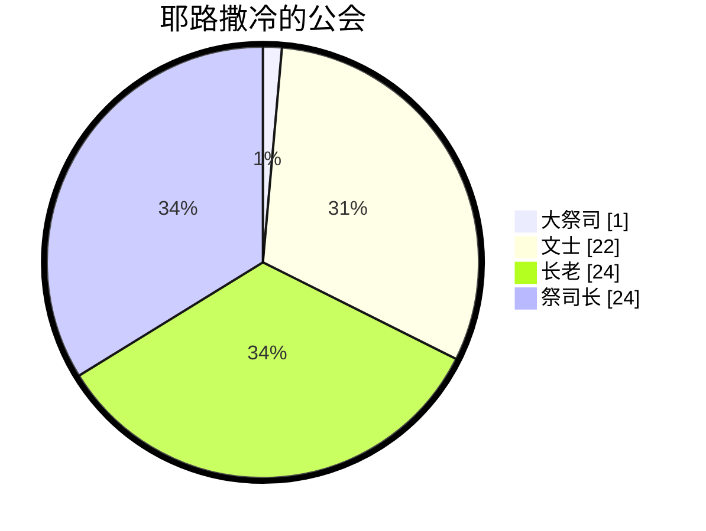
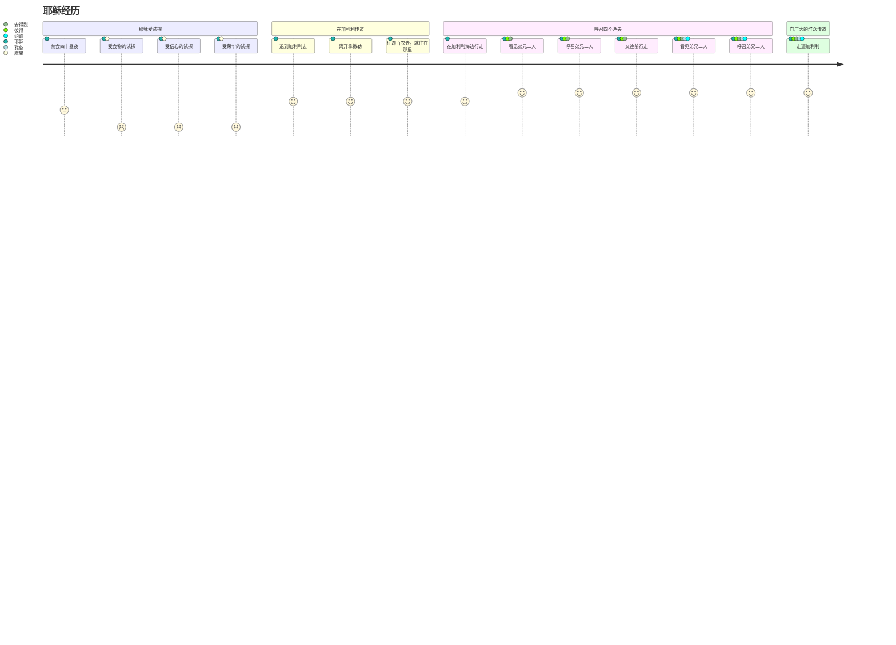

[马太福音](https://www.bible.com/bible/111/MAT.4.NIV)
[第一章](#第一章)
[第二章](#第二章)
[第三章](#第三章)
[第四章](#第四章)

## 第一章
### 经文
1 亚伯拉罕的后裔，大卫的子孙，耶稣基督的家谱：
2 亚伯拉罕生以撒；以撒生雅各；雅各生犹大和他的弟兄； 3犹大从她玛氏生法勒斯和谢拉；法勒斯生希斯仑；希斯仑生亚兰； 4亚兰生亚米拿达；亚米拿达生拿顺；拿顺生撒门； 5撒门从喇合氏生波阿斯；波阿斯从路得氏生俄备得；俄备得生耶西； 6耶西生大卫王。大卫从乌利亚的妻子生所罗门； 7所罗门生罗波安；罗波安生亚比雅；亚比雅生亚撒； 8亚撒生约沙法；约沙法生约兰； 约兰生乌西雅； 9乌西雅生约坦；约坦生亚哈斯；亚哈斯生希西家； 10希西家生玛拿西；玛拿西生亚们；亚们生约西亚； 11百姓被迁到巴比伦的时候，约西亚生耶哥尼雅和他的弟兄。12迁到巴比伦之后，耶哥尼雅生撒拉铁；撒拉铁生所罗巴伯； 13所罗巴伯生亚比玉；亚比玉生以利亚敬；以利亚敬生亚所； 14亚所生撒督；撒督生亚金；亚金生以律； 15以律生以利亚撒；以利亚撒生马但；马但生雅各； 16雅各生约瑟，就是马利亚的丈夫。那称为基督的耶稣是从马利亚生的。
17这样，从亚伯拉罕到大卫共有十四代；从大卫到迁至巴比伦的时候也有十四代；从迁至巴比伦的时候到基督又有十四代。18耶稣基督降生的事记在下面：他母亲马利亚已经许配给约瑟，还没有迎娶，马利亚就从圣灵怀了孕。 19她丈夫约瑟是个义人，不愿意当众羞辱她，想要暗地里把她休了。 20正考虑这些事的时候，忽然主的使者在约瑟梦中向他显现，说：“大卫的子孙约瑟，不要怕，把你的妻子马利亚娶过来，因她所怀的孕是从圣灵来的。 21她将要生一个儿子，你要给他起名叫耶稣，因他要将自己的百姓从罪恶里救出来。” 22这整件事的发生，是要应验主藉先知所说的话：
23“必有童女怀孕生子；人要称他的名为以马内利。”（以马内利翻出来就是“上帝与我们同在”。）
24 约瑟醒来，就遵照主的使者的吩咐把妻子娶过来； 25但是没有和她同房，直到她生了儿子，就给他起名叫耶稣。
### 观察
1. 马太福音以什么形式开始
2. 家谱中有几个母亲？
3. 家谱中有几代？
4. 摩西/约书亚在哪里？他们在家谱中吗？
### 解释
1. 为什么说是亚伯拉罕的后裔，大卫的子孙？
2. 为什么是这四位母亲？她们有什么特征？
3. 为什么分三个14代？每个14代都有什么特征？
4. 为什么以家谱开始？

### 归纳
 - 亚伯拉罕-大卫：家族
 - 大卫到迁移： 国
 - 迁移到新约：重建/救赎

神的计划和拣选是神的主权
1. 启示战胜律法、自我 
2. 旧约的应许实现在新约
3. 神借人做工
### 应用
	神借人做工，我们如何回应？
## 第二章
### 经文
#### 博学之士朝拜
1在希律作王的时候，耶稣生在犹太的伯利恒。有几个博学之士从东方来到耶路撒冷，说： 2“那生下来作犹太人之王的在哪里？我们在东方看见他的星，特来拜他。” 3希律王听见了，就心里不安；耶路撒冷全城的人也都不安。 4他就召集了祭司长和民间的文士，问他们：“基督该生在哪里？” 5他们说：“在犹太的伯利恒。因为有先知记着：
6‘犹大地的伯利恒啊，
你在犹大诸城中并不是最小的；
因为将来有一位统治者要从你那里出来，
牧养我以色列民。’”
7于是，希律暗地里召了博学之士来，查问那星是什么时候出现的， 8就派他们往伯利恒去，说：“你们去仔细寻访那小孩子，找到了就来报信，我也好去拜他。” 9他们听了王的话就去了。忽然，在东方所看到的那颗星在前面引领他们，一直行到小孩子所在地方的上方就停住了。 10他们看见那星，就非常欢喜； 11进了房子，看见小孩子和他母亲马利亚，就俯伏拜那小孩子，揭开宝盒，拿出黄金、乳香、没药，作为礼物献给他。 12因为在梦中得到主的指示，不要回去见希律，他们就从别的路回自己的家乡去了。
#### 逃往埃及
13他们走后，忽然主的使者在约瑟梦中向他显现，说：“起来！带着小孩子和他母亲逃往埃及，住在那里，等我的指示；因为希律要搜寻那小孩子来杀害他。” 14约瑟就起来，连夜带着小孩子和他母亲往埃及去， 15住在那里，直到希律死了。这是要应验主藉先知所说的话：“我从埃及召我的儿子出来。”
### 屠杀男孩
16 希律见自己被博学之士愚弄，极其愤怒，差人将伯利恒城里和四境所有的男孩，根据他向博学之士仔细查问到的时间，凡两岁以内的，都杀尽了。 17这就应验了耶利米先知所说的话：
18“在拉玛听见号啕大哭的声音，
是拉结哭她儿女；
她不肯受安慰，
因为他们都不在了。”
#### 从埃及回来
19 希律死了以后，在埃及，忽然主的使者在约瑟梦中向他显现， 20说：“起来，带着小孩子和他母亲回以色列地去！因为要杀害这小孩子的人已经死了。” 21约瑟就起来，带着小孩子和他母亲进入以色列地去。 22但是他因听见亚基老继承他父亲希律作了犹太王，怕到那里去；又在梦中得到主的指示，就往加利利境内去了。 23他们到了一座城，名叫拿撒勒，就住在那里。这是要应验先知所说的话：“他将称为拿撒勒人。”
### 观察
1. 希律王听见了，就心里不安，为什么？
2. 为什么耶路撒冷全城的人也都不安？
3. 博士来的作用？好的影响？不好的影响？
4. 博士献的什么礼物？
	[黄金](https://www.bible.com/search/bible?query=%E9%BB%84%E9%87%91)
	[乳香](https://www.bible.com/search/bible?query=%E4%B9%B3%E9%A6%99)
	[没药](https://www.bible.com/search/bible?query=%E6%B2%A1%E8%8D%AF)

|   |   |   |   |
|---|---|---|---|
|**人物**|**引导/启示方式**|**反应**|**预言的应验**|
|博士|星/梦|带礼物敬拜/离开|犹大地的伯利恒啊|
|约瑟|梦|离开/回来|我从埃及召我的儿子出来/他将称为拿撒勒人|
|希律王|无/问别人|不安/杀戮|耶利米先知所说的话|
|祭司长和文士|先知的话|应该包括在全城人（不安）|犹大地的伯利恒啊|
|耶路撒冷全城的人|听博士说|不安||

### 解释

### 应用
神的主权：
- 耶稣为王
- 神要成就的事一定会成就，可以用不同人不同方式呈现出来。
- 我们需要做的。。。？
## 第三章
### 经文

##### 施洗约翰传道
可1‧1－8；路3‧1－18；约1‧19－28）
1那时，有施洗的约翰出来，在犹太的旷野传道，说： 2「天国近了，你们应当悔改」 3这人就是先知以赛亚所说的。他说：「在旷野有人声喊着说：预备主的道，修直他的路」
4这约翰身穿骆驼毛的衣服，腰束皮带，吃的是蝗虫、野蜜。 5那时，耶路撒冷和犹太全地，并约旦河一带地方的人，都出去到约翰那里， 6承认他们的罪，在约旦河里受他的洗。 7约翰看见许多法利赛人和撒都该人也来受洗，就对他们说：「毒蛇的种类！谁指示你们逃避将来的忿怒呢？ 8你们要结出果子来，与悔改的心相称。 9不要自己心里说：『有亚伯拉罕为我们的祖宗。』我告诉你们，　神能从这些石头中给亚伯拉罕兴起子孙来。 10现在斧子已经放在树根上，凡不结好果子的树就砍下来，丢在火里。 11我是用水给你们施洗，叫你们悔改。但那在我以后来的，能力比我更大，我就是给他提鞋也不配。他要用圣灵与火给你们施洗。 12他手里拿着簸箕，要扬净他的场，把麦子收在仓里，把糠用不灭的火烧尽了。」
##### 耶稣受洗
（可1‧9－11；路3‧21－22）
13当下，耶稣从加利利来到约旦河，见了约翰，要受他的洗。 14约翰想要拦住他，说：「我当受你的洗，你反倒上我这里来吗？」 15耶稣回答说：「你暂且许我，因为我们理当这样尽诸般的义。」于是约翰许了他。 16耶稣受了洗，随即从水里上来。天忽然为他开了，他就看见　神的灵仿佛鸽子降下，落在他身上。 17从天上有声音说：「这是我的爱子，我所喜悦的。」

### 观察
- 时间，地点，人物，事件，原因和经过
- 约翰穿什么？吃什么？
- 约翰的使命是什么？
- 约翰的身上，可以看到有哪些特质？
- 约翰的影响有哪些？
- 约翰是如何看待耶稣的？
- 法利赛人和撒都该人是什么人？约翰为什么称他们毒蛇的种类
- 洗礼在耶稣身上体现的是什么？
- 约翰和耶稣的关系怎么描述的？
- 如果没有耶稣，约翰还有存在的价值吗？如果没有约翰，耶稣还有存在的价值吗？
### 解释
1. 旷野在哪里？[犹太的旷野](https://zh.wikipedia.org/zh-hans/%E7%8A%B9%E5%A4%A7%E6%97%B7%E9%87%8E#cite_note-1)
2. 约翰为什么给人施洗？人们为什么要到他这里受洗？
3. 水洗VS圣灵和火洗？
4. 受洗和认罪悔改有什么关系？
5. 法利赛人和撒都该人是什么人
	1. 犹太宗教领袖分为几派，最大的两派是法利赛派和撒都该派。法利赛人来自不同的阶层，他们把自己从一切非犹太事物中分别出来，严守圣经中的律法和一切口头传统。撒都该人是世袭的祭司与贵族，只相信五经（创、出、利、民、申）是神的话语。这两派彼此敌视，却一同反对耶稣。施洗约翰抨击法利赛人的律法主义和伪善，撒都该人的利用宗教提高自己的政治地位。
	2. 耶路撒冷公会的组成: #文士 （法利赛人） #长老 （平民代表） #祭司长(撒都该人)

&#128221;  
---
 [以赛亚书 40](https://www.bible.com/bible/48/ISA.40.CUNPSS-神):3 有人声喊着说：在旷野预备耶和华的路，在沙漠地修平我们　神的道。   
 [列王纪下 1](https://www.bible.com/bible/48/2KI.1.CUNPSS-神)：8 回答说：「他身穿毛衣，腰束皮带。」王说：「这必是提斯比人以利亚。   
 [耶利米书 46](https://www.bible.com/bible/48/JER.46.CUNPSS-神): 22其中的声音好像蛇行一样。敌人要成队而来，如砍伐树木的手拿斧子攻击他。   
 [马太福音 12](https://www.bible.com/bible/48/MAT.12.CUNPSS-神): 33「你们或以为树好，果子也好；树坏，果子也坏；因为看果子就可以知道树。 34毒蛇的种类！你们既是恶人，怎能说出好话来呢？因为心里所充满的，口里就说出来。 35善人从他心里所存的善就发出善来；恶人从他心里所存的恶就发出恶来。   
 [马太福音 23](https://www.bible.com/bible/48/MAT.23.CUNPSS-神): 33你们这些蛇类、毒蛇之种啊，怎能逃脱地狱的刑罚呢？   

### 归纳
1. 悔改 - 象征性：受洗
2. 洁净 - 真正回到神 子民的圣洁中
3. 尽诸般的义 - 以顺服为中心的与神的关系
4. 约翰是过程，耶稣是目的
5. 约翰非常清楚自己的位置

### 应用
1. 在我们的日常生活中，如何经历悔改，洁净和顺服
2. 我们要经历什么过程，达到什么目的
3. 如何不在过程中丢失自己的目的

## 第四章 
### 经文
#### 耶稣受试探
（[可1‧12－13](https://www.bible.com/bible/48/MRK.1.CUNPSS-神)；[路4‧1－13](https://www.bible.com/bible/48/LUK.4.CUNPSS-神)）  
1当时，耶稣被圣灵引到旷野，受魔鬼的试探。 2他禁食四十昼夜，后来就饿了。 3那试探人的进前来，对他说：「你若是　神的儿子，可以吩咐这些石头变成食物。」 4耶稣却回答说：「[经上](https://www.bible.com/zh-CN/bible/48/DEU.8.3)记着说：人活着，不是单靠食物，乃是靠　神口里所出的一切话。」5魔鬼就带他进了圣城，叫他站在殿顶上， 6对他说：「你若是　神的儿子，可以跳下去，因为[经上](https://www.bible.com/zh-CN/bible/48/psa.91.12)记着说：主要为你吩咐他的使者用手托着你，免得你的脚碰在石头上。」7耶稣对他说：「[经上](https://www.bible.com/zh-CN/bible/48/deu.6.16)又记着说：『不可试探主－你的　神。』」 8魔鬼又带他上了一座最高的山，将世上的万国与万国的荣华都指给他看， 9对他说：「你若俯伏拜我，我就把这一切都赐给你。」 10耶稣说：「撒但，退去吧！因为[经上](https://www.bible.com/zh-CN/bible/48/deu.6.13)记着说：当拜主－你的　神，单要事奉他。」11于是，魔鬼离了耶稣，有天使来伺候他。
#### 开始在加利利传道
（[可1‧14－15](https://www.bible.com/bible/48/MRK.1.CUNPSS-神)；[路4‧14－15](https://www.bible.com/bible/48/LUK.4.CUNPSS-神)）  
12耶稣听见约翰下了监，就退到加利利去； 13后又离开拿撒勒，往迦百农去，就住在那里。那地方靠海，在西布伦和拿弗他利的边界上。 14这是要应验先知[以赛亚的话](https://www.bible.com/zh-CN/bible/48/ISA.9)， 15说：西布伦地，拿弗他利地，就是沿海的路，约旦河外，外邦人的加利利地－   
16那坐在黑暗里的百姓看见了大光；坐在死荫之地的人有光发现照着他们。   
17从那时候，耶稣就传起道来，说：「天国近了，你们应当悔改！」
#### 呼召四个渔夫
（[可1‧16－20](https://www.bible.com/bible/48/MRK.1.CUNPSS-神)；[路5‧1－11](https://www.bible.com/bible/48/LUK.5.CUNPSS-神)）  
18耶稣在加利利海边行走，看见弟兄二人，就是那称呼彼得的西门和他兄弟安得烈，在海里撒网；他们本是打鱼的。 19耶稣对他们说：「来跟从我，我要叫你们得人如得鱼一样。」 20他们就立刻舍了网，跟从了他。 21从那里往前走，又看见弟兄二人，就是西庇太的儿子雅各和他兄弟约翰，同他们的父亲西庇太在船上补网，耶稣就招呼他们， 22他们立刻舍了船，别了父亲，跟从了耶稣。
#### 耶稣向广大的群众传道
（[路6‧17－19](https://www.bible.com/bible/48/LUK.6.CUNPSS-神)）
23耶稣走遍加利利，在各会堂里教训人，传天国的福音，医治百姓各样的病症。 24他的名声就传遍了叙利亚。那里的人把一切害病的，就是害各样疾病、各样疼痛的和被鬼附的、癫痫的、瘫痪的，都带了来，耶稣就治好了他们。 25当下，有许多人从加利利、低加坡里、耶路撒冷、犹太、约旦河外来跟着他。
### 观察
- 时间，地点，人物，事件，原因和经过
- 这一章总的有哪四件事情？
- 耶稣受洗后，经历了什么？（1-11）
- 耶稣禁食了多少天？几次试探？（2，3-11）
- 耶稣经历的试探都有什么？（3，5-6，8-9）
- 耶稣对这些试探都有什么回应？（4，7，10）
- 耶稣有两段传福音描述？（12-17）VS （23-25），比较这两段有什么不同吗？
- 耶稣在加利利海边行走，看见谁？他们在干什么？耶稣做了什么？（18-19）
- 耶稣往前走，又看见谁？他们在干什么？耶稣做了什么？（21）
- 这些人对耶稣的呼召，有什么反应？（20，22）
- 呼召人以后，耶稣做了什么？（23-25）
### 解释
[试探](https://wd.bible/exegesis) 

12耶稣听见约翰下了监，就退到加利利去； 13后又离开拿撒勒，往迦百农去，就住在那里。那地方靠海，在西布伦和拿弗他利的边界上。 

14这是要应验先知以赛亚的话， 15说：   
西布伦地，拿弗他利地，就是沿海的路，约旦河外，外邦人的加利利地－   
16那坐在黑暗里的百姓看见了大光；坐在死荫之地的人有光发现照着他们。

### 归纳
- 从耶稣的经历，我们可以看到什么？受洗->受试探->传道->培养门徒->继续传福音
- 神的光照亮黑暗中的人
- 人活着，不是单靠食物，乃是靠　神口里所出的一切话
- 门徒对呼召的反应： 立刻舍了。。。
### 应用
- 作为基督徒，我们如何做、生活？
- 作为门徒，如何回应呼召？我们有否只跟不舍？

## 第五章
### 经文
### 观察
### 解释
### 归纳
### 应用

## 第六章
### 经文
### 观察
### 解释
### 归纳
### 应用

## 第七章
### 经文
### 观察
### 解释
### 归纳
### 应用

## 第八章
### 经文
### 观察
### 解释
### 归纳
### 应用
