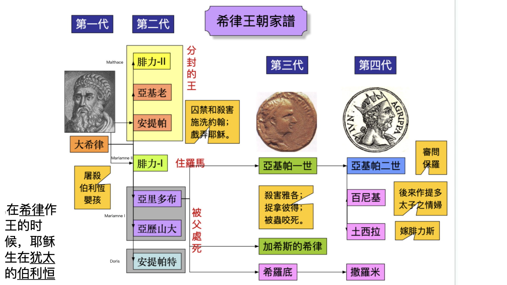
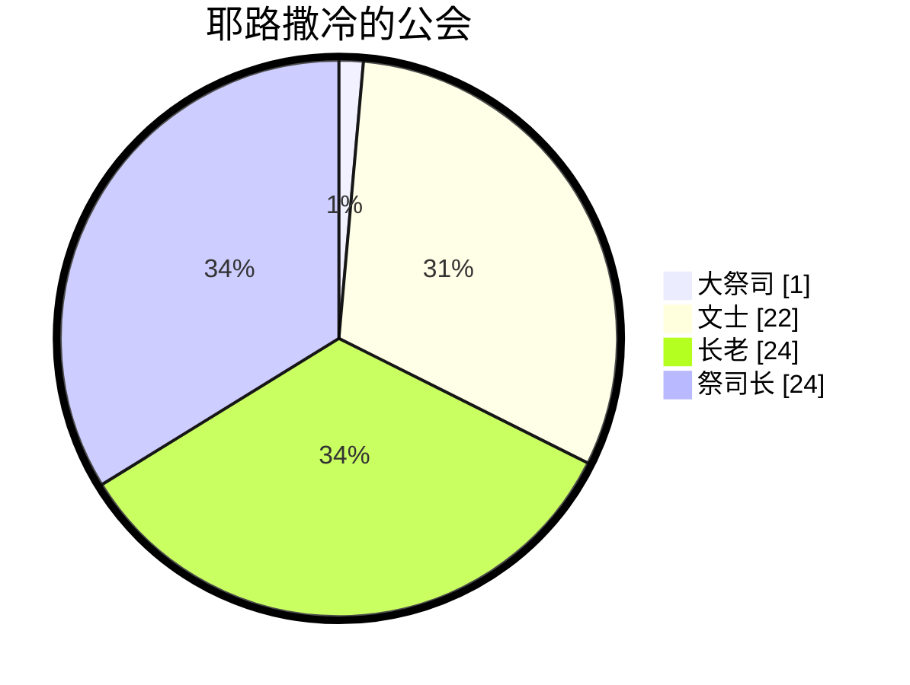
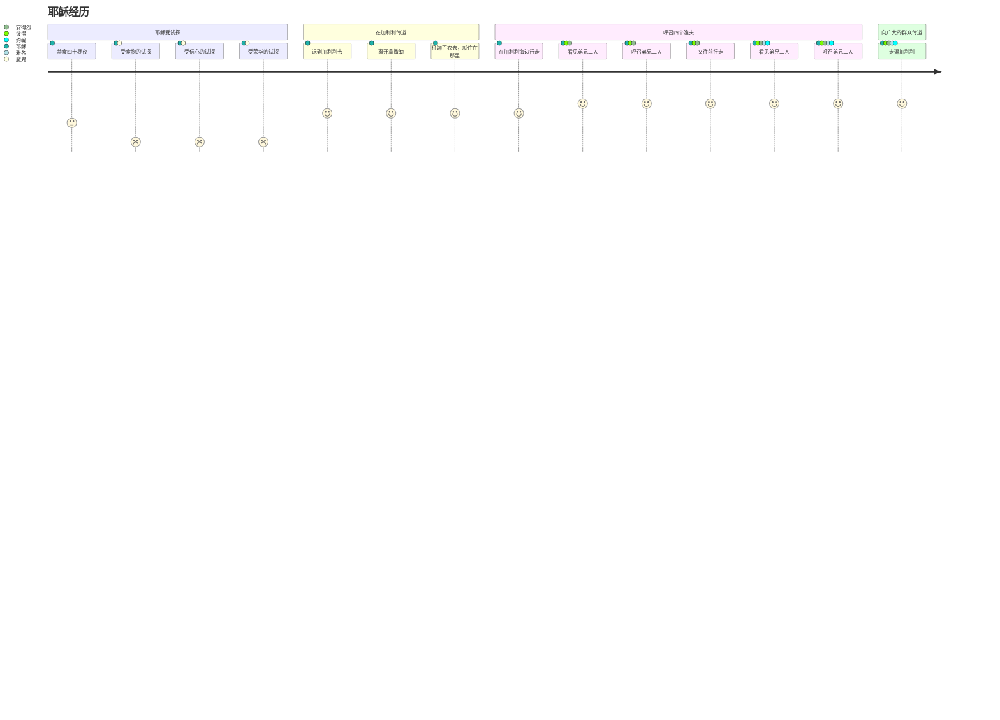

[马太福音](https://www.bible.com/bible/111/MAT.4.NIV)
[第一章](#第一章)
[第二章](#第二章)
[第三章](#第三章)
[第四章](#第四章)
[第五章](#第五章)
[第六章](#第六章)
[第七章](#第七章)
[第八章](#第八章)
[第九章](#第九章)

## 第一章
### 经文
1 亚伯拉罕的后裔，大卫的子孙，耶稣基督的家谱：
2 亚伯拉罕生以撒；以撒生雅各；雅各生犹大和他的弟兄； 3犹大从她玛氏生法勒斯和谢拉；法勒斯生希斯仑；希斯仑生亚兰； 4亚兰生亚米拿达；亚米拿达生拿顺；拿顺生撒门； 5撒门从喇合氏生波阿斯；波阿斯从路得氏生俄备得；俄备得生耶西； 6耶西生大卫王。大卫从乌利亚的妻子生所罗门； 7所罗门生罗波安；罗波安生亚比雅；亚比雅生亚撒； 8亚撒生约沙法；约沙法生约兰； 约兰生乌西雅； 9乌西雅生约坦；约坦生亚哈斯；亚哈斯生希西家； 10希西家生玛拿西；玛拿西生亚们；亚们生约西亚； 11百姓被迁到巴比伦的时候，约西亚生耶哥尼雅和他的弟兄。12迁到巴比伦之后，耶哥尼雅生撒拉铁；撒拉铁生所罗巴伯； 13所罗巴伯生亚比玉；亚比玉生以利亚敬；以利亚敬生亚所； 14亚所生撒督；撒督生亚金；亚金生以律； 15以律生以利亚撒；以利亚撒生马但；马但生雅各； 16雅各生约瑟，就是马利亚的丈夫。那称为基督的耶稣是从马利亚生的。
17这样，从亚伯拉罕到大卫共有十四代；从大卫到迁至巴比伦的时候也有十四代；从迁至巴比伦的时候到基督又有十四代。18耶稣基督降生的事记在下面：他母亲马利亚已经许配给约瑟，还没有迎娶，马利亚就从圣灵怀了孕。 19她丈夫约瑟是个义人，不愿意当众羞辱她，想要暗地里把她休了。 20正考虑这些事的时候，忽然主的使者在约瑟梦中向他显现，说：“大卫的子孙约瑟，不要怕，把你的妻子马利亚娶过来，因她所怀的孕是从圣灵来的。 21她将要生一个儿子，你要给他起名叫耶稣，因他要将自己的百姓从罪恶里救出来。” 22这整件事的发生，是要应验主藉先知所说的话：
23“必有童女怀孕生子；人要称他的名为以马内利。”（以马内利翻出来就是“上帝与我们同在”。）
24 约瑟醒来，就遵照主的使者的吩咐把妻子娶过来； 25但是没有和她同房，直到她生了儿子，就给他起名叫耶稣。
### 观察
1. 马太福音以什么形式开始
2. 家谱中有几个母亲？
3. 家谱中有几代？
4. 摩西/约书亚在哪里？他们在家谱中吗？
### 解释
1. 为什么说是亚伯拉罕的后裔，大卫的子孙？
2. 为什么是这四位母亲？她们有什么特征？
3. 为什么分三个14代？每个14代都有什么特征？
4. 为什么以家谱开始？

### 归纳
 - 亚伯拉罕-大卫：家族
 - 大卫到迁移： 国
 - 迁移到新约：重建/救赎

神的计划和拣选是神的主权
1. 启示战胜律法、自我 
2. 旧约的应许实现在新约
3. 神借人做工
### 应用
	神借人做工，我们如何回应？
## 第二章
### 经文
#### 博学之士朝拜
1在希律作王的时候，耶稣生在犹太的伯利恒。有几个博学之士从东方来到耶路撒冷，说： 2“那生下来作犹太人之王的在哪里？我们在东方看见他的星，特来拜他。” 3希律王听见了，就心里不安；耶路撒冷全城的人也都不安。 4他就召集了祭司长和民间的文士，问他们：“基督该生在哪里？” 5他们说：“在犹太的伯利恒。因为有先知记着：
6‘犹大地的伯利恒啊，
你在犹大诸城中并不是最小的；
因为将来有一位统治者要从你那里出来，
牧养我以色列民。’”
7于是，希律暗地里召了博学之士来，查问那星是什么时候出现的， 8就派他们往伯利恒去，说：“你们去仔细寻访那小孩子，找到了就来报信，我也好去拜他。” 9他们听了王的话就去了。忽然，在东方所看到的那颗星在前面引领他们，一直行到小孩子所在地方的上方就停住了。 10他们看见那星，就非常欢喜； 11进了房子，看见小孩子和他母亲马利亚，就俯伏拜那小孩子，揭开宝盒，拿出黄金、乳香、没药，作为礼物献给他。 12因为在梦中得到主的指示，不要回去见希律，他们就从别的路回自己的家乡去了。
#### 逃往埃及
13他们走后，忽然主的使者在约瑟梦中向他显现，说：“起来！带着小孩子和他母亲逃往埃及，住在那里，等我的指示；因为希律要搜寻那小孩子来杀害他。” 14约瑟就起来，连夜带着小孩子和他母亲往埃及去， 15住在那里，直到希律死了。这是要应验主藉先知所说的话：“我从埃及召我的儿子出来。”
### 屠杀男孩
16 希律见自己被博学之士愚弄，极其愤怒，差人将伯利恒城里和四境所有的男孩，根据他向博学之士仔细查问到的时间，凡两岁以内的，都杀尽了。 17这就应验了耶利米先知所说的话：
18“在拉玛听见号啕大哭的声音，
是拉结哭她儿女；
她不肯受安慰，
因为他们都不在了。”
#### 从埃及回来
19 希律死了以后，在埃及，忽然主的使者在约瑟梦中向他显现， 20说：“起来，带着小孩子和他母亲回以色列地去！因为要杀害这小孩子的人已经死了。” 21约瑟就起来，带着小孩子和他母亲进入以色列地去。 22但是他因听见亚基老继承他父亲希律作了犹太王，怕到那里去；又在梦中得到主的指示，就往加利利境内去了。 23他们到了一座城，名叫拿撒勒，就住在那里。这是要应验先知所说的话：“他将称为拿撒勒人。”
### 观察
1. 希律王听见了，就心里不安，为什么？
2. 为什么耶路撒冷全城的人也都不安？
3. 博士来的作用？好的影响？不好的影响？
4. 博士献的什么礼物？
	[黄金](https://www.bible.com/search/bible?query=%E9%BB%84%E9%87%91)
	[乳香](https://www.bible.com/search/bible?query=%E4%B9%B3%E9%A6%99)
	[没药](https://www.bible.com/search/bible?query=%E6%B2%A1%E8%8D%AF)

|   |   |   |   |
|---|---|---|---|
|**人物**|**引导/启示方式**|**反应**|**预言的应验**|
|博士|星/梦|带礼物敬拜/离开|犹大地的伯利恒啊|
|约瑟|梦|离开/回来|我从埃及召我的儿子出来/他将称为拿撒勒人|
|希律王|无/问别人|不安/杀戮|耶利米先知所说的话|
|祭司长和文士|先知的话|应该包括在全城人（不安）|犹大地的伯利恒啊|
|耶路撒冷全城的人|听博士说|不安||

### 解释

### 应用
神的主权：
- 耶稣为王
- 神要成就的事一定会成就，可以用不同人不同方式呈现出来。
- 我们需要做的。。。？
## 第三章
### 经文

##### 施洗约翰传道
可1‧1－8；路3‧1－18；约1‧19－28）
1那时，有施洗的约翰出来，在犹太的旷野传道，说： 2「天国近了，你们应当悔改」 3这人就是先知以赛亚所说的。他说：「在旷野有人声喊着说：预备主的道，修直他的路」
4这约翰身穿骆驼毛的衣服，腰束皮带，吃的是蝗虫、野蜜。 5那时，耶路撒冷和犹太全地，并约旦河一带地方的人，都出去到约翰那里， 6承认他们的罪，在约旦河里受他的洗。 7约翰看见许多法利赛人和撒都该人也来受洗，就对他们说：「毒蛇的种类！谁指示你们逃避将来的忿怒呢？ 8你们要结出果子来，与悔改的心相称。 9不要自己心里说：『有亚伯拉罕为我们的祖宗。』我告诉你们，　神能从这些石头中给亚伯拉罕兴起子孙来。 10现在斧子已经放在树根上，凡不结好果子的树就砍下来，丢在火里。 11我是用水给你们施洗，叫你们悔改。但那在我以后来的，能力比我更大，我就是给他提鞋也不配。他要用圣灵与火给你们施洗。 12他手里拿着簸箕，要扬净他的场，把麦子收在仓里，把糠用不灭的火烧尽了。」
##### 耶稣受洗
（可1‧9－11；路3‧21－22）
13当下，耶稣从加利利来到约旦河，见了约翰，要受他的洗。 14约翰想要拦住他，说：「我当受你的洗，你反倒上我这里来吗？」 15耶稣回答说：「你暂且许我，因为我们理当这样尽诸般的义。」于是约翰许了他。 16耶稣受了洗，随即从水里上来。天忽然为他开了，他就看见　神的灵仿佛鸽子降下，落在他身上。 17从天上有声音说：「这是我的爱子，我所喜悦的。」

### 观察
- 时间，地点，人物，事件，原因和经过
- 约翰穿什么？吃什么？
- 约翰的使命是什么？
- 约翰的身上，可以看到有哪些特质？
- 约翰的影响有哪些？
- 约翰是如何看待耶稣的？
- 法利赛人和撒都该人是什么人？约翰为什么称他们毒蛇的种类
- 洗礼在耶稣身上体现的是什么？
- 约翰和耶稣的关系怎么描述的？
- 如果没有耶稣，约翰还有存在的价值吗？如果没有约翰，耶稣还有存在的价值吗？
### 解释
1. 旷野在哪里？[犹太的旷野](https://zh.wikipedia.org/zh-hans/%E7%8A%B9%E5%A4%A7%E6%97%B7%E9%87%8E#cite_note-1)
2. 约翰为什么给人施洗？人们为什么要到他这里受洗？
3. 水洗VS圣灵和火洗？
4. 受洗和认罪悔改有什么关系？
5. 法利赛人和撒都该人是什么人
	1. 犹太宗教领袖分为几派，最大的两派是法利赛派和撒都该派。法利赛人来自不同的阶层，他们把自己从一切非犹太事物中分别出来，严守圣经中的律法和一切口头传统。撒都该人是世袭的祭司与贵族，只相信五经（创、出、利、民、申）是神的话语。这两派彼此敌视，却一同反对耶稣。施洗约翰抨击法利赛人的律法主义和伪善，撒都该人的利用宗教提高自己的政治地位。
	2. 耶路撒冷公会的组成: #文士 （法利赛人） #长老 （平民代表） #祭司长(撒都该人)

&#128221;  
---
 [以赛亚书 40](https://www.bible.com/bible/48/ISA.40.CUNPSS-神):3 有人声喊着说：在旷野预备耶和华的路，在沙漠地修平我们　神的道。   
 [列王纪下 1](https://www.bible.com/bible/48/2KI.1.CUNPSS-神)：8 回答说：「他身穿毛衣，腰束皮带。」王说：「这必是提斯比人以利亚。   
 [耶利米书 46](https://www.bible.com/bible/48/JER.46.CUNPSS-神): 22其中的声音好像蛇行一样。敌人要成队而来，如砍伐树木的手拿斧子攻击他。   
 [马太福音 12](https://www.bible.com/bible/48/MAT.12.CUNPSS-神): 33「你们或以为树好，果子也好；树坏，果子也坏；因为看果子就可以知道树。 34毒蛇的种类！你们既是恶人，怎能说出好话来呢？因为心里所充满的，口里就说出来。 35善人从他心里所存的善就发出善来；恶人从他心里所存的恶就发出恶来。   
 [马太福音 23](https://www.bible.com/bible/48/MAT.23.CUNPSS-神): 33你们这些蛇类、毒蛇之种啊，怎能逃脱地狱的刑罚呢？   

### 归纳
1. 悔改 - 象征性：受洗
2. 洁净 - 真正回到神 子民的圣洁中
3. 尽诸般的义 - 以顺服为中心的与神的关系
4. 约翰是过程，耶稣是目的
5. 约翰非常清楚自己的位置

### 应用
1. 在我们的日常生活中，如何经历悔改，洁净和顺服
2. 我们要经历什么过程，达到什么目的
3. 如何不在过程中丢失自己的目的

## 第四章 
### 经文
#### 耶稣受试探
（[可1‧12－13](https://www.bible.com/bible/48/MRK.1.CUNPSS-神)；[路4‧1－13](https://www.bible.com/bible/48/LUK.4.CUNPSS-神)）  
1当时，耶稣被圣灵引到旷野，受魔鬼的试探。 2他禁食四十昼夜，后来就饿了。 3那试探人的进前来，对他说：「你若是　神的儿子，可以吩咐这些石头变成食物。」 4耶稣却回答说：「[经上](https://www.bible.com/zh-CN/bible/48/DEU.8.3)记着说：人活着，不是单靠食物，乃是靠　神口里所出的一切话。」5魔鬼就带他进了圣城，叫他站在殿顶上， 6对他说：「你若是　神的儿子，可以跳下去，因为[经上](https://www.bible.com/zh-CN/bible/48/psa.91.12)记着说：主要为你吩咐他的使者用手托着你，免得你的脚碰在石头上。」7耶稣对他说：「[经上](https://www.bible.com/zh-CN/bible/48/deu.6.16)又记着说：『不可试探主－你的　神。』」 8魔鬼又带他上了一座最高的山，将世上的万国与万国的荣华都指给他看， 9对他说：「你若俯伏拜我，我就把这一切都赐给你。」 10耶稣说：「撒但，退去吧！因为[经上](https://www.bible.com/zh-CN/bible/48/deu.6.13)记着说：当拜主－你的　神，单要事奉他。」11于是，魔鬼离了耶稣，有天使来伺候他。
#### 开始在加利利传道
（[可1‧14－15](https://www.bible.com/bible/48/MRK.1.CUNPSS-神)；[路4‧14－15](https://www.bible.com/bible/48/LUK.4.CUNPSS-神)）  
12耶稣听见约翰下了监，就退到加利利去； 13后又离开拿撒勒，往迦百农去，就住在那里。那地方靠海，在西布伦和拿弗他利的边界上。 14这是要应验先知[以赛亚的话](https://www.bible.com/zh-CN/bible/48/ISA.9)， 15说：西布伦地，拿弗他利地，就是沿海的路，约旦河外，外邦人的加利利地－   
16那坐在黑暗里的百姓看见了大光；坐在死荫之地的人有光发现照着他们。   
17从那时候，耶稣就传起道来，说：「天国近了，你们应当悔改！」
#### 呼召四个渔夫
（[可1‧16－20](https://www.bible.com/bible/48/MRK.1.CUNPSS-神)；[路5‧1－11](https://www.bible.com/bible/48/LUK.5.CUNPSS-神)）  
18耶稣在加利利海边行走，看见弟兄二人，就是那称呼彼得的西门和他兄弟安得烈，在海里撒网；他们本是打鱼的。 19耶稣对他们说：「来跟从我，我要叫你们得人如得鱼一样。」 20他们就立刻舍了网，跟从了他。 21从那里往前走，又看见弟兄二人，就是西庇太的儿子雅各和他兄弟约翰，同他们的父亲西庇太在船上补网，耶稣就招呼他们， 22他们立刻舍了船，别了父亲，跟从了耶稣。
#### 耶稣向广大的群众传道
（[路6‧17－19](https://www.bible.com/bible/48/LUK.6.CUNPSS-神)）
23耶稣走遍加利利，在各会堂里教训人，传天国的福音，医治百姓各样的病症。 24他的名声就传遍了叙利亚。那里的人把一切害病的，就是害各样疾病、各样疼痛的和被鬼附的、癫痫的、瘫痪的，都带了来，耶稣就治好了他们。 25当下，有许多人从加利利、低加坡里、耶路撒冷、犹太、约旦河外来跟着他。
### 观察
- 时间，地点，人物，事件，原因和经过
- 这一章总的有哪四件事情？
- 耶稣受洗后，经历了什么？（1-11）
- 耶稣禁食了多少天？几次试探？（2，3-11）
- 耶稣经历的试探都有什么？（3，5-6，8-9）
- 耶稣对这些试探都有什么回应？（4，7，10）
- 耶稣有两段传福音描述？（12-17）VS （23-25），比较这两段有什么不同吗？
- 耶稣在加利利海边行走，看见谁？他们在干什么？耶稣做了什么？（18-19）
- 耶稣往前走，又看见谁？他们在干什么？耶稣做了什么？（21）
- 这些人对耶稣的呼召，有什么反应？（20，22）
- 呼召人以后，耶稣做了什么？（23-25）
### 解释
[试探](https://wd.bible/exegesis) 

12耶稣听见约翰下了监，就退到加利利去； 13后又离开拿撒勒，往迦百农去，就住在那里。那地方靠海，在西布伦和拿弗他利的边界上。 

14这是要应验先知以赛亚的话， 15说：   
西布伦地，拿弗他利地，就是沿海的路，约旦河外，外邦人的加利利地－   
16那坐在黑暗里的百姓看见了大光；坐在死荫之地的人有光发现照着他们。

### 归纳
- 从耶稣的经历，我们可以看到什么？受洗->受试探->传道->培养门徒->继续传福音
- 神的光照亮黑暗中的人
- 人活着，不是单靠食物，乃是靠　神口里所出的一切话
- 门徒对呼召的反应： 立刻舍了。。。
### 应用
- 作为基督徒，我们如何做、生活？
- 作为门徒，如何回应呼召？我们有否只跟不舍？

## 第五章
### 经文
#### 山上寶訓
1耶穌看見這許多的人，就上了山，既已坐下，門徒到他跟前來， 2他就開口教訓他們，說：  
##### 論福  
[路6‧20－23](https://www.bible.com/bible/48/LUK.6.20-23.CUNPSS-神)  
3虛心的人有福了！因為天國是他們的。   
4哀慟的人有福了！因為他們必得安慰。   
5溫柔的人有福了！因為他們必承受地土。   
6飢渴慕義的人有福了！因為他們必得飽足。   
7憐恤人的人有福了！因為他們必蒙憐恤。   
8清心的人有福了！因為他們必得見神。   
9使人和睦的人有福了！因為他們必稱為神的兒子。   
10為義受逼迫的人有福了！因為天國是他們的。   
11「人若因我辱罵你們，逼迫你們，捏造各樣壞話毀謗你們，你們就有福了！ 12應當歡喜快樂，因為你們在天上的賞賜是大的。在你們以前的先知，人也是這樣逼迫他們。」
##### 鹽和光
[可9‧50](https://www.bible.com/bible/48/MRK.9.50.CUNPSS-神)；[路14‧34－3](https://www.bible.com/bible/48/LUK.14.34-25.CUNPSS-神)   
13「你們是世上的鹽。鹽若失了味，怎能叫它再鹹呢？以後無用，不過丟在外面，被人踐踏了。 14你們是世上的光。城造在山上是不能隱藏的。 15人點燈，不放在斗底下，是放在燈臺上，就照亮一家的人。 16你們的光也當這樣照在人前，叫他們看見你們的好行為，便將榮耀歸給你們在天上的父。」
##### 論律法
17「莫想我來要廢掉律法和先知。我來不是要廢掉，乃是要成全。 18我實在告訴你們，就是到天地都廢去了，律法的一點一畫也不能廢去，都要成全。 19所以，無論何人廢掉這誡命中最小的一條，又教訓人這樣做，他在天國要稱為最小的。但無論何人遵行這誡命，又教訓人遵行，他在天國要稱為大的。 20我告訴你們，你們的義若不勝於文士和法利賽人的義，斷不能進天國。」
##### 論發怒
21「你們聽見有吩咐古人的話，說：『不可殺人』；又說：『凡殺人的難免受審判。』 22只是我告訴你們，凡向弟兄動怒的，難免受審判；凡罵弟兄是拉加的，難免公會的審判；凡罵弟兄是魔利的，難免地獄的火。 23所以，你在祭壇上獻禮物的時候，若想起弟兄向你懷怨， 24就把禮物留在壇前，先去同弟兄和好，然後來獻禮物。 25你同告你的對頭還在路上，就趕緊與他和息，恐怕他把你送給審判官，審判官交付衙役，你就下在監裏了。 26我實在告訴你，若有一文錢沒有還清，你斷不能從那裏出來。」
##### 論姦淫
27「你們聽見有話說：『不可姦淫。』 28只是我告訴你們，凡看見婦女就動淫念的，這人心裏已經與她犯姦淫了。 29若是你的右眼叫你跌倒，就剜出來丟掉，寧可失去百體中的一體，不叫全身丟在地獄裏。 30若是右手叫你跌倒，就砍下來丟掉，寧可失去百體中的一體，不叫全身下入地獄。」
##### 論休妻
[太19‧9](https://www.bible.com/bible/46/MAT.19.9.CUNP-神); 
[可10‧11－12](https://www.bible.com/bible/48/MRK.10.11-12.CUNPSS-神)；
[路16‧18](https://www.bible.com/bible/48/LUK.16.18.CUNPSS-神)    
31「又有話說：『人若休妻，就當給她休書。』 32只是我告訴你們，凡休妻的，若不是為淫亂的緣故，就是叫她作淫婦了；人若娶這被休的婦人，也是犯姦淫了。」
##### 論起誓
33「你們又聽見有吩咐古人的話，說：『不可背誓，所起的誓總要向主謹守。』 34只是我告訴你們，甚麼誓都不可起。不可指着天起誓，因為天是神的座位； 35不可指着地起誓，因為地是他的腳凳；也不可指着耶路撒冷起誓，因為耶路撒冷是大君的京城； 36又不可指着你的頭起誓，因為你不能使一根頭髮變黑變白了。 37你們的話，是，就說是；不是，就說不是；若再多說就是出於那惡者 。」
##### 論報復
[路6‧29－30](https://www.bible.com/bible/48/LUK.6.29-30.CUNPSS-神)   
38「你們聽見有話說：『以眼還眼，以牙還牙。』 39只是我告訴你們，不要與惡人作對。有人打你的右臉，連左臉也轉過來由他打； 40有人想要告你，要拿你的裏衣，連外衣也由他拿去； 41有人強逼你走一里路，你就同他走二里； 42有求你的，就給他；有向你借貸的，不可推辭。」
##### 論愛仇敵
[路6‧27－28](https://www.bible.com/bible/48/LUK.6.27-28.CUNPSS-神); [路6‧32－36](https://www.bible.com/bible/48/LUK.6.32-36.CUNPSS-神)   
43「你們聽見有話說：『當愛你的鄰舍，恨你的仇敵。』 44只是我告訴你們，要愛你們的仇敵，為那逼迫你們的禱告。 45這樣就可以作你們天父的兒子；因為他叫日頭照好人，也照歹人；降雨給義人，也給不義的人。 46你們若單愛那愛你們的人，有甚麼賞賜呢？就是稅吏不也是這樣行嗎？ 47你們若單請你弟兄的安，比人有甚麼長處呢？就是外邦人不也是這樣行嗎？ 48所以，你們要完全，像你們的天父完全一樣。」

### 观察
- 时间，地点，人物，事件，原因和经过
- 这里的听众最有可能是谁？
- 11节的你们和前几节的他们，是同样的人吗？
- 盐有什么主要用途？ 

### 解释

|得居圣山者的品行|论福(接受神国要求的人所应有的态度)|英文（除一福和八福外，用的都是将来式）|
|---|---|---|
|[诗篇15](https://www.bible.com/bible/48/PSA.15.CUNPSS-神)|[马太福音5](https://www.bible.com/bible/48/MAT.5.CUNPSS-神)|[NIV](https://www.bible.com/bible/111/MAT.5.NIV) |
|1耶和华啊，谁能寄居你的帐幕？谁能住在你的圣山？|3虚心的人有福了！因为天国是他们的。|3 “Blessed are the poor in spirit,for theirs **is** the kingdom of heaven.  |
|2就是行为正直、做事公义、心里说实话的人。|4哀恸的人有福了！因为他们必得安慰。|4 Blessed are those who mourn,for they **will** be comforted. |
|3他不以舌头谗谤人，不恶待朋友，也不随伙毁谤邻里。|5温柔的人有福了！因为他们必承受地土。|5 Blessed are the meek,for they **will** inherit the earth.  |
|4他眼中藐视匪类，却尊重那敬畏耶和华的人。他发了誓，虽然自己吃亏也不更改。|6饥渴慕义的人有福了！因为他们必得饱足。|6 Blessed are those who hunger and thirst for righteousness, for they **will** be filled.|
|5他不放债取利，不受贿赂以害无辜。行这些事的人必永不动摇。|7怜恤人的人有福了！因为他们必蒙怜恤。|7 Blessed are the merciful, for they **will** be shown mercy. |
||8清心的人有福了！因为他们必得见　神。|8 Blessed are the pure in heart, for they **will** see God. |
||9使人和睦的人有福了！因为他们必称为　神的儿子。|9 Blessed are the peacemakers, for they **will** be called children of God.|
||10为义受逼迫的人有福了！因为天国是他们的。|10 Blessed are those who are persecuted because of righteousness, for theirs **is** the kingdom of heaven. |

[有福了](https://wd.bible/exegesis)
- Strong Number :	G3107
- 词型 (Morphology) :	形容词 / 主格 (主语) 复数 阳性
- 词根 (Lemma) :	μακάριος
- 词义 (Glossary) :	有福 / 蒙福的 / 有福的 / 祝福 / 蒙福 / 可称颂 / 有福气 / 万幸

1. 虚心的人(the poor in spirit) 一、原意「乞讨」，倚靠他人救助的，亦或仅贫穷的。有时并非单指经济方面的不良状况。而是指因受欺压，而觉悟特别需要神之救助，而盼望很快求得。二、「软弱，可怜，乞怜，无能的」
   [可以譯成「認識到自己需要上帝的人有福了」。](https://wd.bible/exegesis)
- 太 5:3 “虚心的人有福了！因为天国是他们的。
- 太 11:5 就是瞎子看见，瘸子行走，长大麻风的洁净，聋子听见，死人复活，穷人有福音传给他们。
- 太 19:21 耶稣说：“你若愿意作完全人，可去变卖你所有的，分给穷人，就必有财宝在天上；你还要来跟从我。”
- 太 26:9 这香膏可以卖许多钱，周济穷人。”
- 太 26:11 因为常有穷人和你们同在；只是你们不常有我。
- 可 10:21 耶稣看着他，就爱他，对他说：“你还缺少一件：去变卖你所有的，分给穷人，就必有财宝在天上；你还要来跟从我。”
- 可 12:42 有一个穷寡妇来，往里投了两个小钱，就是一个大钱。
- 可 12:43 耶稣叫门徒来，说：“我实在告诉你们，这穷寡妇投入库里的，比众人所投的更多。
- 可 14:5 这香膏可以卖三十多两银子周济穷人。”他们就向那女人生气。
- 可 14:7 因为常有穷人和你们同在，要向他们行善随时都可以；只是你们不常有我。
- 路 4:18 “主的灵在我身上，因为他用膏膏我，叫我传福音给贫穷的人；差遣我报告：被掳的得释放，瞎眼的得看见，叫那受压制的得自由，
- 路 6:20 耶稣举目看着门徒，说：“你们贫穷的人有福了！因为神的国是你们的。
- 路 7:22 耶稣回答说：“你们去，把所看见所听见的事告诉约翰，就是瞎子看见，瘸子行走，长大麻风的洁净，聋子听见，死人复活，穷人有福音传给他们。
- 路 14:13 你摆设筵席，倒要请那贫穷的、残废的、瘸腿的、瞎眼的，你就有福了！
- 路 14:21 那仆人回来，把这事都告诉了主人。家主就动怒，对仆人说：‘快出去，到城里大街小巷，领那贫穷的、残废的、瞎眼的、瘸腿的来。’
- 路 16:20 又有一个讨饭的，名叫拉撒路，浑身生疮，被人放在财主门口，
- 路 16:22 后来那讨饭的死了，被天使带去放在亚伯拉罕的怀里。财主也死了，并且埋葬了。
- 路 18:22 耶稣听见了，就说：“你还缺少一件：要变卖你一切所有的，分给穷人，就必有财宝在天上；你还要来跟从我。”
- 路 19:8 撒该站着对主说：“主啊，我把所有的一半给穷人；我若讹诈了谁，就还他四倍。”
- 路 21:3 就说：“我实在告诉你们，这穷寡妇所投的比众人还多；
2. 哀恸的人 (mourn) - 由於令人沮喪的環境或人的狀況而感到悲傷痛苦 哀慟；哀痛；痛心；悲傷；悲哀；為……哭泣
  (不及物：「悲恸，哀伤，悲悼」。与内在和外在的喜乐相反。及物：与人称的直接受格连用：因人的缘故忧愁)
- 太 5:4 哀恸的人有福了！因为他们必得安慰。
- 太 9:15 耶稣对他们说：“新郎和陪伴之人同在的时候，陪伴之人岂能哀恸呢？但日子将到，新郎要离开他们，那时候他们就要禁食。
- 可 16:10 她去告诉那向来跟随耶稣的人；那时他们正哀恸哭泣。
- 路 6:25 你们饱足的人有祸了！因为你们将要饥饿。你们喜笑的人有祸了！因为你们将要哀恸哭泣。
- 林前 5:2 你们还是自高自大，并不哀痛，把行这事的人从你们中间赶出去。
- 林后 12:21 且怕我来的时候，我的神叫我在你们面前惭愧，又因许多人从前犯罪，行污秽、奸淫、邪荡的事不肯悔改，我就忧愁。
- 雅 4:9 你们要愁苦、悲哀、哭泣，将喜笑变作悲哀，欢乐变作愁闷。
- 启 18:11 地上的客商也都为她哭泣悲哀，因为没有人再买他们的货物了；
- 启 18:15 贩卖这些货物、藉着她发了财的客商，因怕她的痛苦，就远远地站着哭泣悲哀，
- 启 18:19 他们又把尘土撒在头上，哭泣悲哀，喊着说：“哀哉！哀哉！这大城啊！”凡有船在海中的，都因她的珍宝成了富足，她在一时之间就成了荒场！
3. 温柔的人(meek) - 温和, 谦卑, 细心
- 太 5:5 温柔的人有福了！因为他们必承受地土。
- 太 11:29 我心里柔和谦卑，你们当负我的轭，学我的样式；这样，你们心里就必得享安息。
- 太 21:5 “要对锡安的居民说：‘看哪，你的王来到你这里，是温柔的，又骑着驴，就是骑着驴驹子。’”
- 彼前 3:4 只要以里面存着长久温柔、安静的心为妆饰；这在神面前是极宝贵的。
4. 饥渴慕义的人(hunger and thirst for righteousness) 「饥饿，使饥饿」,「渴慕」某物，即「强烈的渴慕」某物
- 太 4:2 他禁食四十昼夜，后来就饿了。
- 太 5:6 饥渴慕义的人有福了！因为他们必得饱足。
- 太 12:1 那时，耶稣在安息日从麦地经过。他的门徒饿了，就掐起麦穗来吃。
- 太 12:3 耶稣对他们说：“经上记着大卫和跟从他的人饥饿之时所做的事，你们没有念过吗？
- 太 21:18 早晨回城的时候，他饿了，
- 太 25:35 因为我饿了，你们给我吃，渴了，你们给我喝；我作客旅，你们留我住；
- 太 25:37 义人就回答说：‘主啊，我们什么时候见你饿了，给你吃，渴了，给你喝？
- 太 25:42 因为我饿了，你们不给我吃，渴了，你们不给我喝；
- 太 25:44 他们也要回答说：‘主啊，我们什么时候见你饿了，或渴了，或作客旅，或赤身露体，或病了，或在监里，不伺候你呢？’
- 可 2:25 耶稣对他们说：“经上记着大卫和跟从他的人缺乏饥饿之时所做的事，你们没有念过吗？
- 可 11:12 第二天，他们从伯大尼出来，耶稣饿了。
- 路 1:53 叫饥饿的得饱美食，叫富足的空手回去。
- 路 4:2 四十天受魔鬼的试探。那些日子没有吃什么；日子满了，他就饿了。
- 路 6:3 耶稣对他们说：“经上记着大卫和跟从他的人饥饿之时所做的事，连这个你们也没有念过吗？
- 路 6:21 你们饥饿的人有福了！因为你们将要饱足。你们哀哭的人有福了！因为你们将要喜笑。
- 路 6:25 你们饱足的人有祸了！因为你们将要饥饿。你们喜笑的人有祸了！因为你们将要哀恸哭泣。
- 约 6:35 耶稣说：“我就是生命的粮。到我这里来的，必定不饿；信我的，永远不渴。
- 罗 12:20 所以，“你的仇敌若饿了，就给他吃，若渴了，就给他喝；因为你这样行就是把炭火堆在他的头上。”
- 林前 4:11 直到如今，我们还是又饥又渴，又赤身露体，又挨打，又没有一定的住处，
- 林前 11:21 因为吃的时候，各人先吃自己的饭，甚至这个饥饿，那个酒醉。
5. 怜恤人的人(the merciful)  仁慈 / 怜悯~的 / 慈悲 / 怜恤人 / 怜恤~的 / 怜悯 / 怜悯人的 / 怜恤人的
- 太 5:7 怜恤人的人有福了！因为他们必蒙怜恤。
- 来 2:17 所以，他凡事该与他的弟兄相同，为要在神的事上成为慈悲忠信的大祭司，为百姓的罪献上挽回祭。
6. 清心的人(the pure in heart) 洁淨的，纯洁的
- 太 5:8 清心的人有福了！因为他们必得见神。
- 太 23:26 你这瞎眼的法利赛人，先洗净杯盘的里面，好叫外面也干净了。
- 太 27:59 约瑟取了身体，用干净细麻布裹好，
- 路 11:41 只要把里面的施舍给人，凡物于你们就都洁净了。
- 约 13:10 耶稣说：“凡洗过澡的人，只要把脚一洗，全身就干净了。你们是干净的，然而不都是干净的。”
- 约 13:11 耶稣原知道要卖他的是谁，所以说：“你们不都是干净的。”
- 约 15:3 现在你们因我讲给你们的道，已经干净了。
- 罗 14:20 不可因食物毁坏神的工程。凡物固然洁净，但有人因食物叫人跌倒，就是他的罪了。
- 提前 1:5 但命令的总归就是爱；这爱是从清洁的心和无亏的良心，无伪的信心生出来的。
- 提前 3:9 要存清洁的良心，固守真道的奥秘。
- 提后 1:3 我感谢神，就是我接续祖先用清洁的良心所侍奉的神。祈祷的时候，不住的想念你，
- 多 1:15 在洁净的人，凡物都洁净；在污秽不信的人，什么都不洁净，连心地和天良也都污秽了。
- 雅 1:27 在神我们的父面前，那清洁没有玷污的虔诚，就是看顾在患难中的孤儿寡妇，并且保守自己不沾染世俗。
- 启 15:6 那掌管七灾的七位天使从殿中出来，穿着洁白光明的细麻衣，胸间束着金带。
- 启 19:8 就蒙恩得穿光明洁白的细麻衣。这细麻衣就是圣徒所行的义。
- 启 19:14 在天上的众军骑着白马，穿着细麻衣，又白又洁，跟随他。
- 启 21:18 墙是碧玉造的；城是精金的，如同明净的玻璃。
7. 使人和睦的人(the peacemakers) 缔造和平的 / 使人和睦的 / 追求和平的人 / 促进和平~人 / 使人和平的人
- 太 5:9 使人和睦的人有福了！因为他们必称为神的儿子。
8. 受逼迫的人(who are persecuted) 1) 急忙, 跑, 奋勇向前 2) 迫害 (因着信仰) 3) 驱离, 赶走 4) 追逐, 追求
- 太 5:10 为义受逼迫的人有福了！因为天国是他们的。
- 太 5:11 人若因我辱骂你们，逼迫你们，捏造各样坏话毁谤你们，你们就有福了！
- 太 5:12 应当欢喜快乐，因为你们在天上的赏赐是大的。在你们以前的先知，人也是这样逼迫他们。”
- 太 5:44 只是我告诉你们，要爱你们的仇敌，为那逼迫你们的祷告。
- 太 10:23 有人在这城里逼迫你们，就逃到那城里去。我实在告诉你们，以色列的城邑，你们还没有走遍，人子就到了。
- 太 23:34 所以我差遣先知和智慧人并文士到你们这里来，有的你们要杀害，要钉十字架；有的你们要在会堂里鞭打，从这城追逼到那城，
- 路 11:49 所以神用智慧曾说：‘我要差遣先知和使徒到他们那里去，有的他们要杀害，有的他们要逼迫’，
- 路 17:23 人将要对你们说：‘看哪，在那里！看哪，在这里！’你们不要出去，也不要跟随他们！
- 路 21:12 但这一切的事以先，人要下手拿住你们，逼迫你们，把你们交给会堂，并且收在监里，又为我的名拉你们到君王诸侯面前。
- 约 5:16 所以犹太人逼迫耶稣，因为他在安息日做了这事。
- 约 15:20 你们要记念我从前对你们所说的话：‘仆人不能大于主人。’他们若逼迫了我，也要逼迫你们；若遵守了我的话，也要遵守你们的话。
= 徒 7:52 哪一个先知不是你们祖宗逼迫呢？他们也把预先传说那义者要来的人杀了；如今你们又把那义者卖了，杀了。
- 徒 9:4 他就仆倒在地，听见有声音对他说：“扫罗！扫罗！你为什么逼迫我？”
- 徒 9:5 他说：“主啊！你是谁？”主说：“我就是你所逼迫的耶稣。
- 徒 22:4 我也曾逼迫奉这道的人，直到死地，无论男女都锁拿下监。
- 徒 22:7 我就仆倒在地，听见有声音对我说：‘扫罗！扫罗！你为什么逼迫我？’
- 徒 22:8 我回答说：‘主啊，你是谁？’他说：‘我就是你所逼迫的拿撒勒人耶稣。’
- 徒 26:11 在各会堂，我屡次用刑强逼他们说亵渎的话，又分外恼恨他们，甚至追逼他们，直到外邦的城邑。”
- 徒 26:14 我们都仆倒在地，我就听见有声音用希伯来话向我说：‘扫罗！扫罗！为什么逼迫我？你用脚踢刺是难的！’
- 徒 26:15 我说：‘主啊，你是谁？’主说：‘我就是你所逼迫的耶稣。
### 盐的主要用途？
[H4417](https://b.ibible.hk/bible/sn/4/H4417) 
[G0217](https://b.ibible.hk/bible/sn/1/G0217)    
  1.调味  
  2.防腐  
  3.人体必需品 电介质  
  4.[智慧](https://www.bible.com/bible/48/COL.4.CUNPSS-神) 
  你们的言语要常常带着和气，好像用盐调和，就可知道该怎样回答各人   
  希腊语代表失去味道的字实际上又有“变得愚蠢”的意思  
  
  > Don't be so heavenly minded that you're no earthly good
  > Don't be so earthly minded that you're no heavenly good
### 光 
[H3974](https://b.ibible.hk/bible/sn/1/H3974) 
[G5457](https://b.ibible.hk/bible/sn/1/G5457)   
> BE LIGHT
> LIGHT by LIFE

### 归纳
- 宝训现在从对门徒品质的概述转到对门徒的直接讲话，告诉他们 这些品质在他们的生活和见证中将会有什么影响
### 应用
- 在这竞争的时代，崇尚大鱼吃小鱼的文化，如何做到使人和睦的人？
## 第六章
### 经文
### 观察
### 解释
### 归纳
### 应用

## 第七章
### 经文
### 观察
### 解释
### 归纳
### 应用

## 第八章
### 经文
### 观察
### 解释
### 归纳
### 应用
